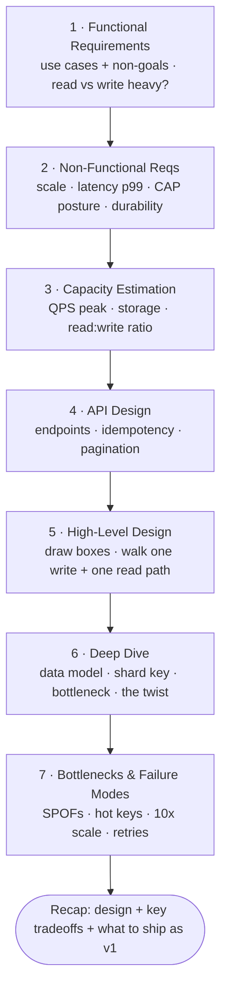

# The Interview / Design Framework

A system design discussion is open-ended on purpose. The interviewer is testing whether you
can impose *structure* on ambiguity. Use the same 7-step loop every time so you never freeze.

> Time budget for a 45-minute interview is in brackets at each step. Adjust, but never skip
> requirements or estimation — skipping them is the #1 way senior candidates underperform.



---

## Step 1 — Scope & functional requirements [~5 min]

Pin down *what the system does* before *how it works*. Ask questions, then write the answers
down where the interviewer can see them.

- **Who are the users and what are the core use cases?** Get the 2-3 that matter. Explicitly
  defer the rest ("I'll treat analytics as out of scope unless you want it").
- **Read vs write heavy?** This single answer reshapes the whole design.
- **What scale?** DAU/MAU, requests/sec, data volume, growth rate.

Then state the **functional requirements** as a short bulleted list and get a nod. Example
(URL shortener): "1) shorten a long URL, 2) redirect a short URL to the original, 3) optional
custom alias, 4) optional expiry." Everything else is non-goals.

> Senior move: explicitly list **non-goals**. It shows you're managing scope deliberately,
> not forgetting things.

## Step 2 — Non-functional requirements [~3 min]

These drive the architecture far more than the features do. Name the ones that matter and
their rough targets:

- **Scale**: QPS (peak, not just average), storage growth, fan-out.
- **Latency**: p50 / p99 targets. "Reads under 100ms p99" is a design constraint.
- **Availability**: how many 9s? Is this CP or AP (see consistency fundamentals)?
- **Consistency**: strong, read-your-writes, or eventual? Per-operation if needed.
- **Durability**: can we ever lose data? (A "like" vs a bank transaction differ.)

State the **CAP posture** explicitly: "This is a feed — I'll favor availability over strong
consistency; a few seconds of staleness is fine." That one sentence signals seniority.

## Step 3 — Capacity estimation (back-of-envelope) [~5 min]

Turn the scale numbers into concrete pressure on the system. See
`fundamentals/01-back-of-envelope.md` for the method. Compute:

- **QPS**: average and peak (peak ≈ 2-10× average; state your multiplier).
- **Storage**: per-record size × records/day × retention. Project to years.
- **Bandwidth**: QPS × payload size.
- **Memory** for caching: how much of the working set fits in RAM? (80/20 rule.)

These numbers justify every later decision: "300 GB/year means a single node is fine for a
year; I'll design sharding now but it won't bite until ~year 3."

## Step 4 — API design [~3 min]

Define the contract. A handful of endpoints is enough. This forces clarity on inputs,
outputs, and who calls what.

```
POST /urls            { longUrl, customAlias?, expiry? } -> { shortUrl }
GET  /{shortCode}     -> 301/302 redirect
```

Mention auth (API key / token), pagination (cursor vs offset), idempotency keys for writes,
and rate-limit headers where relevant.

## Step 5 — High-level design [~10 min]

Draw the boxes. A typical skeleton:

```
Client → DNS → Load Balancer → API/Web servers → [Cache] → Database
                                      ↓
                              Async: Queue → Workers
                                      ↓
                              Blob store / CDN for large objects
```

Walk one **write path** and one **read path** end-to-end. Place the data store(s) and say
*why* (SQL vs NoSQL vs blob vs search index). Identify what's synchronous vs async.

> Start simple. A single DB + app tier is a legitimate v1. Resist the urge to draw Kafka
> and 5 microservices before you've justified them.

## Step 6 — Deep dive [~10 min]

The interviewer steers here, or you pick the most interesting/risky part. This is where the
real signal is. Common deep dives:

- **Data model & storage choice** — schema, indexes, partition/sharding key (the most
  important decision in most designs — see below).
- **Scaling the bottleneck** — the hot read path, the fan-out, the write amplification.
- **Caching** — what, where, eviction, invalidation, stampede protection.
- **Consistency & concurrency** — race conditions, idempotency, exactly-once illusions.
- **The unique twist** — every problem has one (feed = fan-out; rate limiter = the counter;
  chat = presence + delivery; typeahead = the trie + ranking).

**Picking a sharding/partition key is often the crux.** Talk through: even distribution,
avoiding hotspots, supporting the dominant query, and how to reshard later.

## Step 7 — Bottlenecks, failure modes & wrap-up [~4 min]

Proactively stress-test your own design:

- **Single points of failure** → add replication / standby / multi-AZ.
- **Hot spots / thundering herd** → sharding, jittered backoff, request coalescing.
- **What at 10× scale?** Name what breaks first and how you'd evolve it.
- **Failure handling**: retries (with backoff + idempotency), circuit breakers, graceful
  degradation, dead-letter queues.

Close with a 30-second recap: the design, the 1-2 key tradeoffs you made, and what you'd
build first if you had to ship a v1 next week.

---

## Cross-cutting habits that read as "senior"

- **Think out loud.** The interviewer grades reasoning, not the final diagram.
- **Always pair a decision with its cost.** "Denormalize for read speed; cost is write
  amplification and a consistency window I'll close with async repair."
- **Use numbers, not adjectives.** "Fast" → "p99 < 50ms." "A lot of data" → "~2 TB/year."
- **Default to boring tech, justify exotic tech.** Reach for Postgres, Redis, S3, a queue.
  Only invoke Kafka/Cassandra/Spanner when the numbers demand it.
- **Manage the clock.** If you're 25 min in and still in high-level design, you've over-spent.
- **Recover gracefully.** If you realize a mistake, say so and correct it — that's a positive
  signal, not a negative one.

## A reusable component vocabulary

When you need a capability, reach for the standard building block:

| Need | Reach for |
|------|-----------|
| Spread traffic | Load balancer (L4/L7), DNS round-robin, anycast |
| Speed up reads | Cache (Redis/Memcached), CDN, read replicas |
| Decouple / smooth spikes | Message queue (SQS/RabbitMQ), log (Kafka) |
| Store relational data | Postgres/MySQL (+ replicas, then shard) |
| Store huge/simple data | Cassandra / DynamoDB (wide-column / KV) |
| Store blobs | S3 / object store, served via CDN |
| Full-text / ranking | Elasticsearch / search index |
| Coordinate / elect leader | ZooKeeper / etcd (Raft under the hood) |
| Global unique IDs | Snowflake-style, UUID, or ticket server |
| Geo queries | Geohash / quadtree / S2 cells |
| Count at scale | Probabilistic (HyperLogLog, Count-Min Sketch) |
