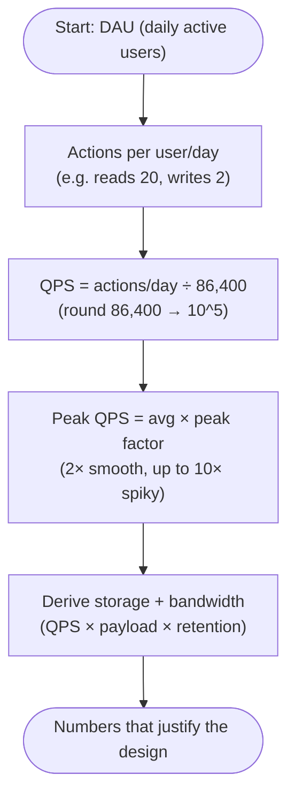

# Back-of-the-Envelope Estimation

The skill: turn vague scale ("millions of users") into concrete numbers that justify design
decisions. You should be able to do this in your head with round numbers. Precision is not
the point — *order of magnitude* is.

## The numbers to memorize

### Powers of two / data sizes
| Power | Approx | Name |
|-------|--------|------|
| 2^10 | ~1 Thousand | 1 KB |
| 2^20 | ~1 Million | 1 MB |
| 2^30 | ~1 Billion | 1 GB |
| 2^40 | ~1 Trillion | 1 TB |
| 2^50 | — | 1 PB |

Typical object sizes (rules of thumb): `char/ASCII` 1 B, `int` 4 B, `long`/`timestamp` 8 B,
`UUID` 16 B, a short text record/row 0.1–1 KB, a tweet/post ~1 KB, a thumbnail ~10–50 KB,
a photo ~0.5–2 MB, a minute of video (compressed) ~5–50 MB.

### Latency numbers every engineer should know (orders of magnitude)
| Operation | Latency |
|-----------|---------|
| L1 cache reference | ~1 ns |
| Branch mispredict | ~3 ns |
| L2 cache reference | ~4 ns |
| Mutex lock/unlock | ~17 ns |
| Main memory reference | ~100 ns |
| Compress 1 KB (Zippy/Snappy) | ~2 µs |
| Read 1 MB sequentially from memory | ~10 µs |
| SSD random read | ~16 µs |
| Read 1 MB from SSD | ~50 µs |
| Round trip within same datacenter | ~500 µs |
| Read 1 MB sequentially from SSD | ~1 ms |
| Disk seek (HDD) | ~5–10 ms |
| Read 1 MB from disk (HDD) | ~20 ms |
| Round trip CA ↔ Netherlands | ~150 ms |

**Takeaways to internalize:**
- Memory is ~100,000× faster than a disk seek. Cache aggressively.
- A cross-region round trip (~150 ms) blows almost any latency budget. Keep data near users.
- Within-DC round trip (~0.5 ms) is cheap; cross-DC/region is not. Chatty cross-region calls kill you.
- Sequential >> random. This is why log-structured stores (LSM trees, Kafka) are fast.

## The estimation method (5 steps)

1. **Start from users.** DAU (daily active users). If given MAU, DAU ≈ MAU × (0.2–0.5).
2. **Actions per user per day.** e.g. a user reads 20 posts, writes 2.
3. **QPS = actions/day ÷ 86,400.** Round 86,400 to ~100,000 (10^5) for mental math.
4. **Peak QPS = average × peak factor.** Use 2× for smooth traffic, up to 10× for spiky.
5. **Derive storage and bandwidth** from QPS × payload × retention.

### Handy constants
- Seconds in a day ≈ **86,400 ≈ 10^5**.
- Seconds in a month ≈ 2.5M; in a year ≈ 31.5M ≈ **3×10^7**.
- 1 million writes/day ≈ **~12 writes/sec** (1M ÷ 86,400).
- **The "1M/day = ~12 QPS" trick** is the single most useful shortcut. Memorize it.

## Worked example: a Twitter-like feed

Given: 300M MAU, 50% daily active → **150M DAU**. Each user posts 2× and reads 100 tweets/day.

- **Write QPS** = 150M × 2 ÷ 86,400 ≈ 300M ÷ 10^5 ≈ **~3,500 writes/sec** (avg). Peak ×3 ≈ **~10K/sec**.
- **Read QPS** = 150M × 100 ÷ 86,400 ≈ 15B ÷ 10^5 ≈ **~175K reads/sec** avg. Peak ≈ **~500K/sec**.
- **Read:write ≈ 50:1** → read-heavy → cache + read replicas + fan-out-on-write are justified.
- **Storage**: 300M tweets/day × 1 KB ≈ **300 GB/day** ≈ **~110 TB/year** (text only).
  Media dominates real storage; mention it's offloaded to blob store + CDN.
- **Cache sizing**: cache the hot 20% of daily reads. Daily reads ≈ 15B; cache ~20% of the
  working set of tweets, not all reads. If hot set is ~tens of GB, it fits comfortably in a
  Redis cluster.

The conclusion writes itself: read-heavy + huge read QPS → caching and replication are
first-class; write QPS is modest enough for a sharded primary store.

## Tips for doing this live

- **Round hard.** 86,400 → 10^5. 365 → 400 or 300. Nobody cares about the 15% error.
- **Keep units explicit.** Writes/sec vs reads/sec vs bytes/sec. Mixing them is the common bug.
- **State assumptions out loud** and write them down. "Assume avg post is 1 KB." If the
  interviewer disagrees, they'll correct you — and you've shown your reasoning.
- **Always compute the read:write ratio.** It dictates the entire architecture.
- **Sanity-check against reality.** If you compute "we need 50,000 servers," recheck — you
  probably slipped a factor of 1000.

## Interview signals
- You reach for numbers *unprompted* to justify a choice.
- You compute peak, not just average, and name your peak multiplier.
- You connect the estimate to a decision ("175K read QPS → we must cache; a single DB can't serve that").
- You separate text storage from media/blob storage.
