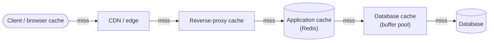
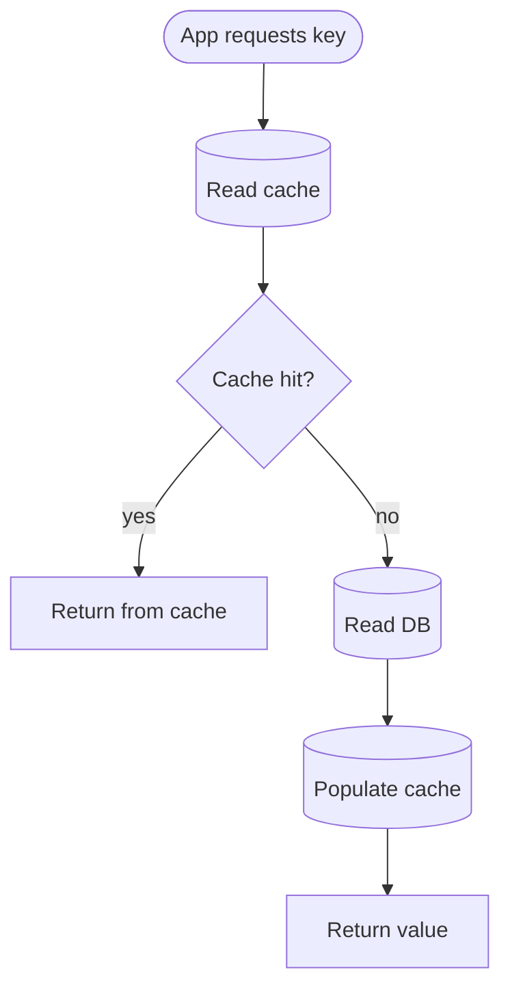
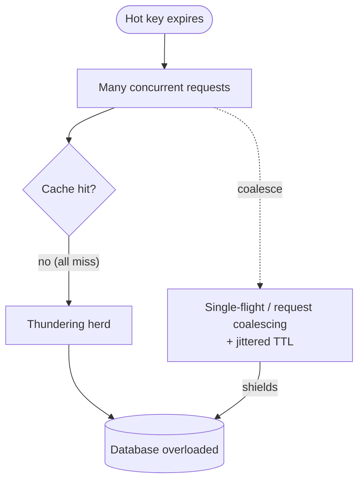

# Caching

Caching is the single highest-leverage technique for read-heavy systems. The whole game is
serving popular data from fast storage (RAM, edge) instead of slow storage (disk, origin, DB).

## Where caches live (client → server)
1. **Browser / client cache** — HTTP cache, local storage. Free, closest to user.
2. **CDN / edge** — static assets and cacheable responses near users.
3. **Reverse-proxy cache** — Varnish/Nginx in front of app servers.
4. **Application cache** — in-process (local) or distributed (Redis/Memcached).
5. **Database cache** — buffer pool, query cache. Mostly automatic.

Each layer that absorbs a request shields everything behind it. Push caching as far toward
the client as correctness allows.

## Local vs distributed cache
- **Local (in-process)**: fastest (no network hop), but each server has its own copy →
  duplication, inconsistency, and cold caches on deploy. Good for tiny, hot, read-mostly data.
- **Distributed (Redis/Memcached cluster)**: shared across app servers, larger capacity,
  consistent view. One network hop (~0.5 ms in-DC). The default for serious caching. Shard
  with **consistent hashing**.

## Caching strategies (read & write patterns)

### Read patterns
- **Cache-aside (lazy loading)** — most common. App checks cache; on miss, reads DB, then
  populates cache. Pros: only requested data is cached; cache failure is survivable. Cons:
  first request per key is slow (miss penalty); risk of stale data until TTL/invalidation.

- **Read-through** — app talks only to the cache; the cache library loads from DB on miss.
  Cleaner app code; cache becomes a dependency.

### Write patterns
- **Write-through** — write to cache **and** DB synchronously. Cache always fresh; write
  latency higher. Good when you read what you just wrote.
- **Write-back (write-behind)** — write to cache, flush to DB asynchronously. Fast writes,
  absorbs bursts; **risk of data loss** if cache dies before flush. Use for tolerant data
  (counters, metrics) with durability safeguards.
- **Write-around** — write straight to DB, bypass cache. Avoids polluting cache with
  write-once data; reads will miss until populated.

> Common production combo: **cache-aside + write-through (or explicit invalidation on write)**.

## Eviction policies
Caches are bounded; something must go when full.
- **LRU** (Least Recently Used) — evict the oldest-used. Default choice; matches temporal locality.
- **LFU** (Least Frequently Used) — evict the least-accessed. Better when popularity is stable.
- **FIFO** — simple, rarely ideal.
- **TTL** — expire after a time, independent of usage. Bounds staleness; combine with LRU.

## The hard part: invalidation
> "There are only two hard things in CS: cache invalidation and naming things."

Stale cache is the classic bug. Options:
- **TTL/expiration** — simplest; accept staleness up to the TTL. Tune per data volatility.
- **Write-through / explicit invalidation** — update or delete the cache key on every write.
  Correct but couples writes to cache; miss one write path and you serve stale forever.
- **Versioned keys** — embed a version/hash in the key (`user:123:v7`); bump on change. Old
  entries age out naturally. Great for content/static assets.
- **Event-driven invalidation** — DB change → publish event → cache invalidates. Scales but
  adds a pipeline.

## Failure modes & protections (senior territory)

### Cache stampede / thundering herd
A hot key expires → thousands of concurrent requests all miss and hammer the DB at once.
Mitigations:
- **Request coalescing / single-flight**: only one request recomputes; others wait for it.
- **Early/probabilistic recomputation**: refresh slightly *before* expiry.
- **Locking**: first miss takes a lock to repopulate; others serve stale or wait.
- **Stagger TTLs with jitter** so keys don't expire in lockstep.

### Cache penetration
Requests for keys that **don't exist** always miss and hit the DB (often an attack).
Mitigate: cache the "null" result with a short TTL; use a **Bloom filter** to reject
known-absent keys cheaply.

### Cache avalanche
Many keys expire simultaneously (e.g. all set with the same TTL) → mass misses. Fix: jittered
TTLs, and keep the DB protected with rate limits / circuit breakers.

### Hot key
One key gets disproportionate traffic and overloads its shard. Fix: replicate the hot key
across nodes, add a local cache tier in front, or split the value.

## Consistency model
A cache is, by nature, a source of **eventual consistency** and stale reads. Decide
explicitly what staleness is acceptable per data type. For strong consistency, either don't
cache or invalidate synchronously on write (write-through) — and accept the latency cost.

## Sizing a cache (back-of-envelope)
- Cache the **working set** — the hot data, typically ~**20%** that serves ~80% of reads.
- Size = hot-item count × item size, plus overhead. Compare to RAM per node × nodes.
- Track **hit ratio** — the key health metric. <80–90% on a read-heavy system means the cache
  is mis-sized or mis-keyed.

## Interview signals
- You name a specific strategy (cache-aside + write-through) and explain the read/write paths.
- You proactively raise stampede / penetration / avalanche and give concrete mitigations.
- You state the staleness/consistency tradeoff explicitly per data type.
- You size the cache from the working set and target a hit ratio.
- You place caches at multiple layers (CDN + Redis), not just one.
