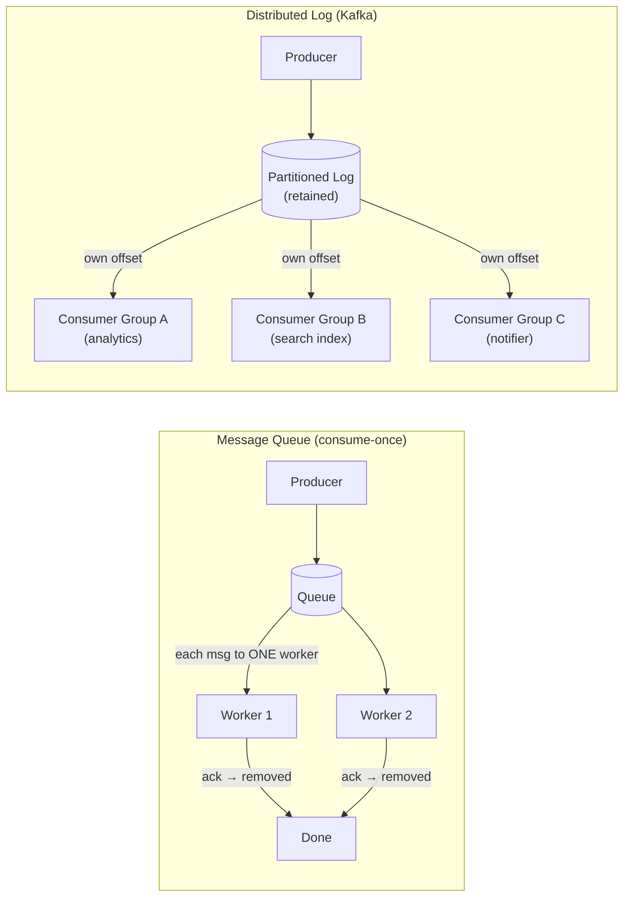
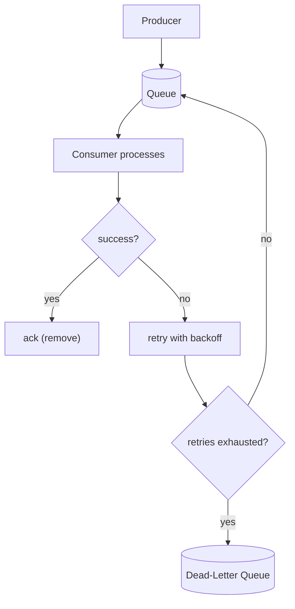

# Messaging, Queues & Streaming

Asynchronous messaging decouples producers from consumers. It's how you absorb spikes, do
work in the background, fan out events, and build systems that don't fall over when one part
is slow.

## Why async / why a queue
- **Decoupling**: producer doesn't know or wait for the consumer. Each scales independently.
- **Load leveling / buffering**: a queue absorbs traffic spikes; consumers drain at their own
  rate instead of the DB getting hammered.
- **Resilience**: if a consumer is down, messages wait instead of being lost.
- **Background work**: return fast to the user, do the slow work later (send email, transcode
  video, update search index, fan out a post).

Rule of thumb: anything not needed to compute the user's immediate response should be async.

## Two shapes: message queue vs event log

### Message queue (RabbitMQ, SQS, ActiveMQ)
- A message is consumed by **one** worker, then removed (or ack'd). Competing-consumers model:
  add workers to process faster.
- Great for **task/work distribution** (job queues).
- Usually no long-term retention; once processed, it's gone.

### Distributed log / streaming (Kafka, Pulsar, Kinesis)
- An **append-only, ordered, partitioned log**. Messages are **retained** (by time/size) and
  re-readable. Consumers track their own **offset**.
- Multiple independent **consumer groups** each read the whole stream → true pub/sub fan-out
  (e.g. analytics, search-indexer, and notifier all consume the same events).
- **Ordering** is guaranteed **within a partition** only. Choose the partition key to keep
  related events ordered (e.g. all events for a user in one partition).
- Massive throughput via sequential disk writes + partitioning. The backbone of event-driven
  architectures and stream processing.

> Mental model: a **queue** is a to-do list that gets consumed; a **log** is a durable,
> replayable history that many readers can independently traverse.

## Pub/Sub
Publishers send to a **topic**; subscribers receive. Decouples senders from an unknown set of
receivers. Implemented via Kafka consumer groups, Google Pub/Sub, SNS, Redis pub/sub, etc.
Use for fan-out: one event → many independent reactions.

## Delivery semantics (know these cold)
- **At-most-once**: may drop, never duplicates. Fire-and-forget. Fine for non-critical metrics.
- **At-least-once**: never drops, may duplicate (retries after a missed ack). The common
  default. **Requires idempotent consumers** — process the same message twice → same result.
- **Exactly-once**: the holy grail. Truly end-to-end exactly-once is very hard; in practice
  it's **at-least-once delivery + idempotent processing** (dedup by message ID), or
  transactional frameworks (Kafka transactions) within a bounded scope. If someone claims
  easy exactly-once, be skeptical.

**Idempotency is the practical key.** Give each message a unique ID; consumers track processed
IDs (dedup table / cache) and ignore repeats. This makes at-least-once safe.

## Operational concerns

> Note: default to **at-least-once delivery + idempotent consumer** (dedup by message ID), so
> retries on the failure path are safe to reprocess.

- **Acknowledgements**: consumer acks after successful processing; un-acked messages get
  redelivered. Ack *after* the work, not before.
- **Visibility timeout** (SQS): a consumed message is hidden for a window; if not ack'd in
  time, it reappears. Tune to the work duration.
- **Dead-letter queue (DLQ)**: messages that fail repeatedly get moved aside for inspection
  instead of blocking the queue forever. Always have one.
- **Backpressure**: when consumers can't keep up, the queue grows. Monitor **queue depth** and
  **consumer lag**; scale consumers, shed load, or rate-limit producers.
- **Poison messages**: a malformed message that crashes consumers on every retry → route to
  DLQ after N attempts.
- **Ordering vs throughput**: strict global ordering limits parallelism. Partition by key to
  get per-key ordering with parallel throughput across keys.

## Stream processing
Process unbounded streams in near-real-time (Kafka Streams, Flink, Spark Streaming):
- **Windowing** (tumbling/sliding/session) to aggregate over time.
- **Stateful** operations (joins, counts) with checkpointing for fault tolerance.
- Use cases: real-time analytics, fraud detection, metric aggregation, CDC pipelines.

## CDC (Change Data Capture)
Stream a database's change log (e.g. via Debezium reading the WAL/binlog) into Kafka. Lets
you keep caches, search indexes, and downstream services in sync **without dual-writes**
(which are racy). Pattern: write to DB → CDC emits change → consumers update derived stores.
Related: the **outbox pattern** — write the business row and an "event" row in one local
transaction, then relay the outbox to the broker, guaranteeing the event is published iff the
write committed.

## When NOT to use a queue
- Synchronous, low-latency request/response (use RPC).
- When end-to-end ordering across everything is mandatory and volume is high (hard to scale).
- Trivial systems where the added moving part isn't justified. Don't add Kafka to a CRUD app
  with 10 QPS just to look sophisticated.

## Interview signals
- You distinguish queue (consume-once work) from log (retained, replayable, multi-consumer).
- You default to at-least-once + idempotent consumers and can explain dedup by message ID.
- You add a DLQ and monitor consumer lag / queue depth unprompted.
- You use a queue to absorb spikes and move slow work off the request path.
- You reach for CDC/outbox instead of dual-writes to keep derived stores in sync.
