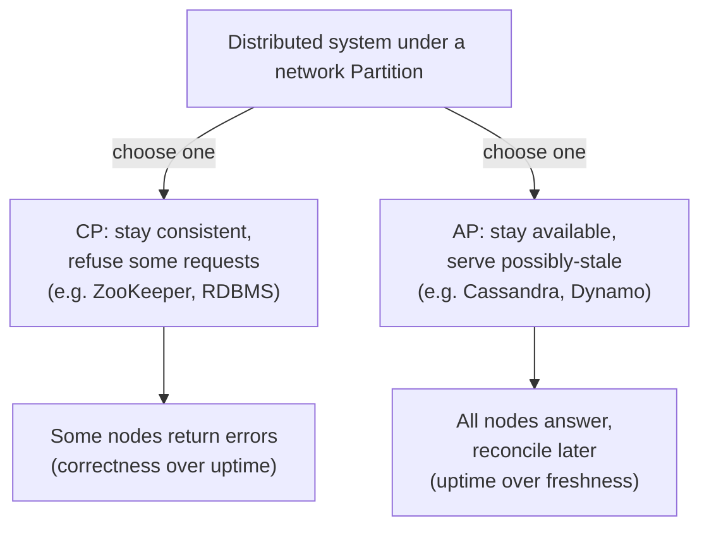
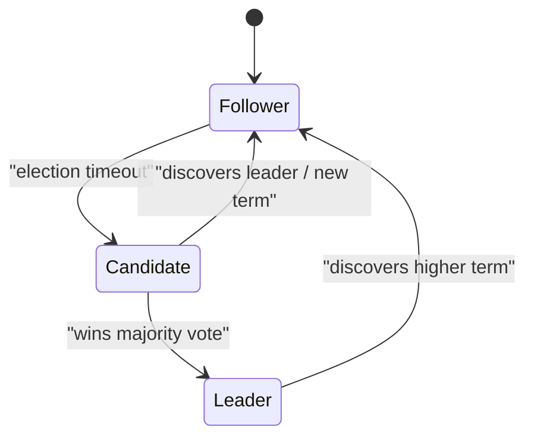

# Consistency, CAP & Consensus

The conceptual core of distributed systems. This is where senior candidates separate
themselves: not by reciting "CAP theorem," but by reasoning precisely about *which*
consistency a given operation needs and *what it costs*.

## CAP theorem
In the presence of a network **P**artition, a distributed system must choose between
**C**onsistency and **A**vailability. You cannot have all three when the network splits.

- **CP** (consistency + partition tolerance): on a partition, refuse requests that can't be
  made consistent → some nodes return errors. Choose when correctness > uptime (banking,
  inventory, locks). Examples: traditional RDBMS with sync replication, ZooKeeper, etcd, HBase.
- **AP** (availability + partition tolerance): on a partition, keep serving with possibly
  stale data; reconcile later. Choose when uptime > strict freshness (feeds, carts,
  DNS, shopping recommendations). Examples: Cassandra, DynamoDB, Riak.

**Crucial nuance:** CAP only governs behavior *during a partition*. The choice is not global
or all-or-nothing — modern systems are **tunable** (e.g. Cassandra per-query consistency
levels) and you can make different choices per operation.

## PACELC — the better mental model
CAP ignores the normal (non-partitioned) case. **PACELC**: if **P**artition, choose **A** or
**C**; **E**lse (normal operation), choose **L**atency or **C**onsistency.

Even with no partition, strong consistency costs latency (you must coordinate replicas). This
is the everyday tradeoff: *do you wait to confirm all replicas agree (consistent, slower) or
answer from the nearest replica (fast, maybe stale)?* PACELC captures what you actually tune
99.9% of the time.

## Consistency models (strongest → weakest)

- **Linearizable / strong**: every read sees the most recent write; the system behaves as if
  there's a single copy. Requires coordination → higher latency, lower availability. Needed
  for locks, leader election, unique constraints, balances.
- **Sequential / causal**: operations respect causal order ("reply appears after the message
  it answers") but not necessarily real-time global order. Often "good enough" and much cheaper.
- **Read-your-own-writes**: you always see your own updates (others may lag). Common UX
  requirement — implement by routing your reads to the leader or a caught-up replica.
- **Monotonic reads**: you never see time go backwards (no reading newer then older). Pin a
  user's session to one replica to guarantee it.
- **Eventual**: replicas converge *if writes stop*. Cheapest, most available. Fine for view
  counts, feeds, DNS. The default for AP systems.

> Senior skill: assign a model **per operation**. "Posting a tweet → eventual is fine.
> Following/unfollow toggle → read-your-writes so the UI doesn't lie. Account balance →
> strong." Don't apply one model to the whole system.

## Quorums (tunable consistency)
With **N** replicas, require **W** acks on write and **R** replicas on read.
- **W + R > N** guarantees read and write sets overlap → reads see the latest write
  (strong-ish). E.g. N=3, W=2, R=2.
- Lower W → faster writes, weaker guarantee. Lower R → faster reads. Tune to your read/write mix.
- **W=N** (write all) → fast consistent reads (R=1) but writes fail if any replica is down.
- **W=1, R=1** → max availability/speed, eventual consistency.
Conflict resolution when copies diverge: **last-write-wins** (needs synced clocks; can lose
data), **version vectors**, or **CRDTs** (mergeable types that converge deterministically).

## Time, ordering & clocks
- **Physical clocks drift** and aren't reliable for ordering events across machines. Don't
  trust wall-clock timestamps to order distributed events.
- **Logical clocks** (Lamport timestamps) give a consistent *happens-before* ordering.
- **Vector clocks** detect concurrent vs causal updates (used in Dynamo-style conflict detection).
- **Hybrid / TrueTime** (Google Spanner): bounded-uncertainty physical clocks (atomic clocks +
  GPS) enable global strong consistency by waiting out the uncertainty window. Powerful but
  requires special hardware/infra.

## Consensus
Getting a set of nodes to **agree on a value** despite failures. Underpins leader election,
distributed locks, config management, and replicated logs.

- **Paxos** — the original, correct, famously hard to understand/implement.
- **Raft** — designed for understandability; the modern default. Concepts:
  - **Leader election**: nodes are follower/candidate/leader; a leader is elected by majority
    vote for a **term**. Heartbeats maintain leadership; timeout triggers a new election.
  - **Log replication**: clients write to the leader; it appends to its log and replicates to
    followers; an entry is **committed** once a **majority** persists it, then applied.
  - **Safety via majority quorums**: needs **N/2 + 1** nodes up → use odd cluster sizes (3, 5).
    A 3-node cluster tolerates 1 failure; 5 tolerates 2.

- You rarely implement consensus yourself — you **use** it via **ZooKeeper / etcd / Consul**
  for coordination (leader election, locks, service discovery, config). Know when to reach for
  them, and that they're CP (they sacrifice availability to stay consistent).

## Distributed locks (a common deep-dive)
- Implement via etcd/ZooKeeper (lease-based, fencing tokens) or Redis (Redlock — controversial).
- **Always use a fencing token** (monotonic number) so a stale lock-holder whose lease expired
  can't corrupt state after a pause/GC. Locks alone aren't safe without fencing.
- Prefer designing to avoid distributed locks (idempotency, single-writer per partition,
  optimistic concurrency) — they're a correctness and availability hazard.

## Interview signals
- You state the CAP posture per system and refine it with PACELC for the normal case.
- You assign a consistency model **per operation**, not one for the whole system.
- You use quorums (W+R>N) to *tune* consistency rather than treating it as binary.
- You reach for etcd/ZooKeeper/Raft for coordination instead of hand-rolling consensus.
- You know not to trust wall clocks for ordering, and mention logical/vector clocks.
- You add fencing tokens when you must use a distributed lock.
