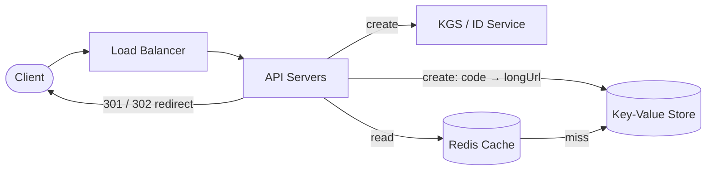
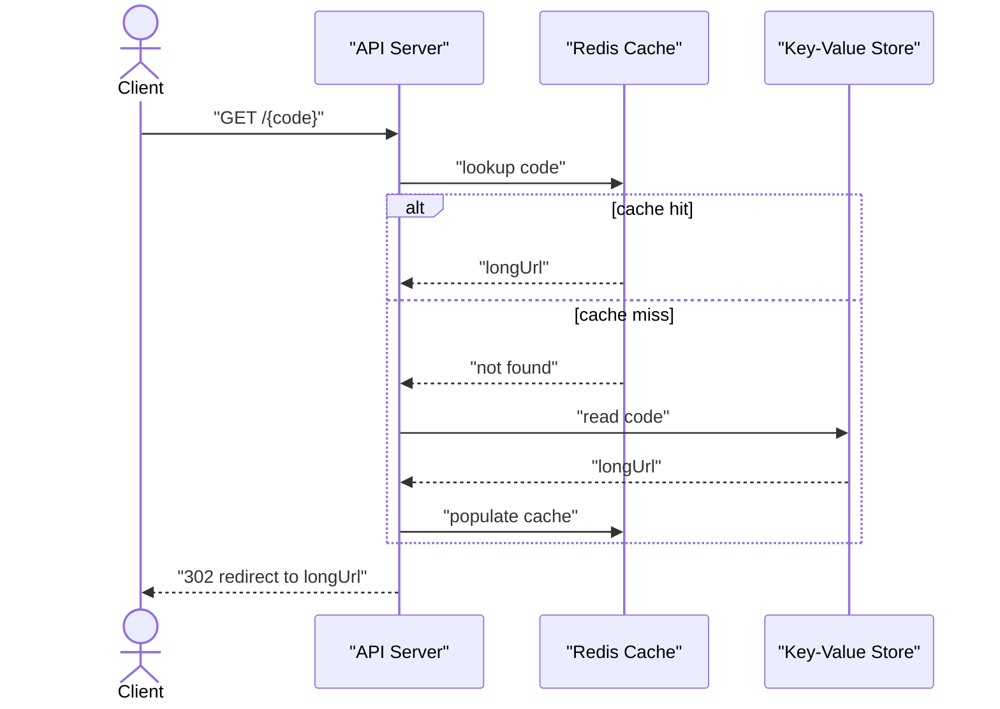
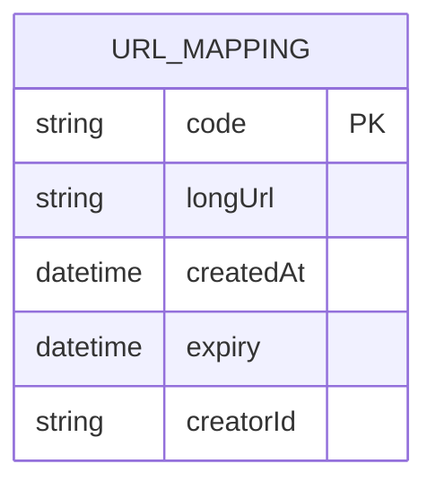

# Problem 1: URL Shortener (TinyURL / bit.ly)

The classic warm-up. Simple enough to finish, deep enough to show judgment. The crux is
**unique ID generation** and **read-heavy scaling**.

## Step 1 — Functional requirements
1. Given a long URL, return a short URL.
2. Visiting the short URL redirects to the original.
3. (Optional) custom alias.
4. (Optional) expiration.
**Non-goals**: user accounts, edit/delete, detailed analytics (mention they're easy to add).

## Step 2 — Non-functional requirements
- **Read-heavy**: redirects vastly outnumber creates (~100:1).
- **Low latency** redirects (p99 < ~50–100ms) — it's in the user's critical path.
- **High availability** — a broken redirect breaks every link ever shared. Favor AP for reads.
- Short codes must be **unique** and ideally **not guessable/enumerable**.

## Step 3 — Capacity estimation
Assume **100M new URLs/day**.
- Write QPS = 100M ÷ 86,400 ≈ **~1,160/s** (avg), peak ×3 ≈ ~3,500/s. Modest.
- Read QPS at 100:1 → **~116K/s** avg, peak ~350K/s. **This is the number that drives caching.**
- **Storage**: per record ≈ key(7B) + longURL(~500B) + metadata(~100B) ≈ ~0.6 KB. 100M/day ≈
  **~60 GB/day** → ~22 TB over a year, ~200 TB over ~10 years. Fits a sharded KV / SQL store.
- **Key space**: base62 (`[A-Za-z0-9]`). 62^7 ≈ **3.5 trillion** combinations → 7 chars is
  plenty for 100M/day for decades. (62^6 ≈ 57B; 7 is the safe choice.)

## Step 4 — API
```
POST /urls   { longUrl, customAlias?, expiry? }  -> { shortUrl }
GET  /{code}                                       -> 301/302 redirect
```
- **301 (permanent)**: browsers cache it → fewer hits to us, but we lose per-visit analytics
  and can't easily change the target. **302 (temporary)**: every visit hits us → analytics +
  control, more load. Pick **302** if analytics/control matter; mention the tradeoff.

## Step 5 — High-level design

- **Write**: generate a unique code, store `code → longURL` (+metadata) in the DB, return short URL.
- **Read**: look up `code` in cache; on miss, read DB, populate cache, redirect. With 100:1
  read:write and a small hot set, cache hit ratio is very high → most redirects never touch the DB.



## Step 6 — Deep dive: generating the short code

This is the heart of the problem. Options:

**A. Hash the URL (e.g. MD5/SHA) → base62, take first 7 chars.**
- Pro: deterministic, same URL → same code (dedup). Con: **collisions** — must check & rehash;
  doesn't dedup if you *want* distinct codes per create.

**B. Random base62 string, check-and-retry on collision.**
- Simple; collision probability is tiny early, grows as space fills (birthday problem) → extra
  DB check per create. Not great at very high write rates.

**C. Auto-increment counter → base62 encode (recommended).**
- A global monotonic ID encoded to base62 gives a **guaranteed-unique, short** code with **no
  collision checks**. ID 1,000,000,000 → ~6 base62 chars.
- **Problem**: a single counter is a SPOF/bottleneck, and sequential codes are **enumerable**
  (security/privacy leak — people can scrape all links).
- **Fixes**:
  - **Distributed ID generation**: a **ticket/ID server** with ranges, or **Snowflake-style**
    IDs (timestamp + machine ID + sequence) for uncoordinated unique IDs across nodes.
  - **Pre-allocated ranges (key-generation service, KGS)**: a service hands each app server a
    block of IDs/keys (e.g. 1M at a time) from a pool; servers assign from their block with no
    per-request coordination. Refill in background. This is clean and fast.
  - **De-enumerate**: don't use the raw sequential code; either generate codes via the KGS pool
    of pre-shuffled keys, or apply a reversible scramble. The KGS-pool approach naturally
    avoids sequential codes.

> Recommended answer: **KGS pre-generating random base62 keys into a pool**, app servers pull
> blocks. Unique without collision checks, non-sequential, no hot counter. Mention Snowflake as
> the alternative when you also need time-ordering.

### Data model & store
`{ code (PK), longUrl, createdAt, expiry, creatorId? }`. Access is pure **key lookup by code**
→ a **KV store / wide-column (DynamoDB/Cassandra)** is ideal and scales horizontally; or
sharded Postgres. **Shard by `code`** (hash partition) → even distribution, and every read is a
single-shard point lookup.



### Custom alias
Treat as a user-provided code: check uniqueness on write (a conditional insert), reject if taken.

### Expiry
Store `expiry`; lazily check on read (treat expired as 404) and/or a background cleanup job /
TTL index removes them. Lazy + background sweep is cheapest.

## Step 7 — Bottlenecks & failure modes
- **Read hot path** → already cached; add read replicas behind the cache. CDN can even cache
  redirects at the edge for ultra-popular links.
- **Cache stampede on a viral link** → request coalescing / it's a single hot key (replicate it).
- **ID service SPOF** → KGS is replicated; blocks are pre-allocated so a brief KGS outage
  doesn't stop creates (servers still have their block).
- **DB scaling** → sharded by code; writes are modest, reads mostly absorbed by cache.
- **Abuse** → rate limit creates; scan submitted URLs against malware/phishing blocklists.
- **Analytics** (if needed) → emit a click event to a queue (Kafka) on each redirect; process
  async so it never slows the redirect.

## Key takeaways
- Recognize read-heavy → cache aggressively; the write side is small.
- The real design decision is **unique, short, non-enumerable ID generation** — KGS pool or
  Snowflake, not a naive single counter.
- KV store sharded by code; 301 vs 302 is a real, articulable tradeoff.
