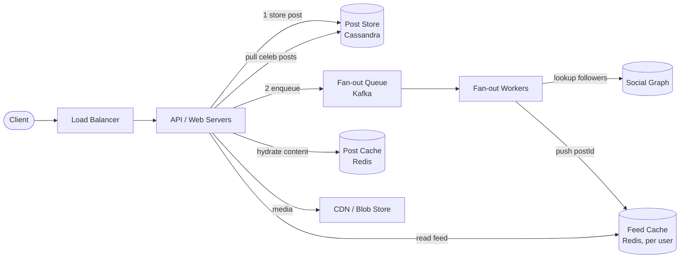
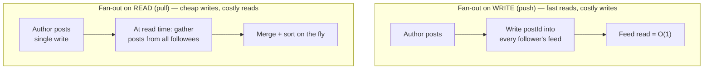
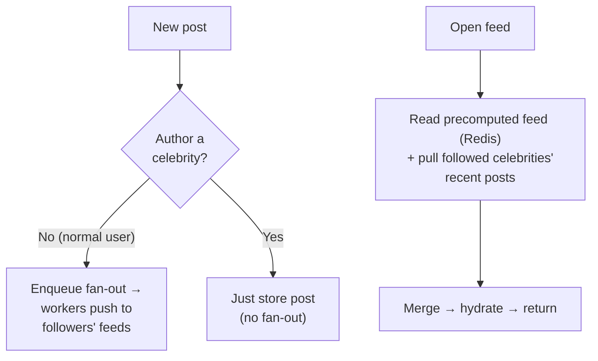
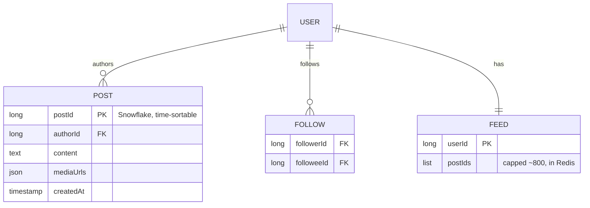
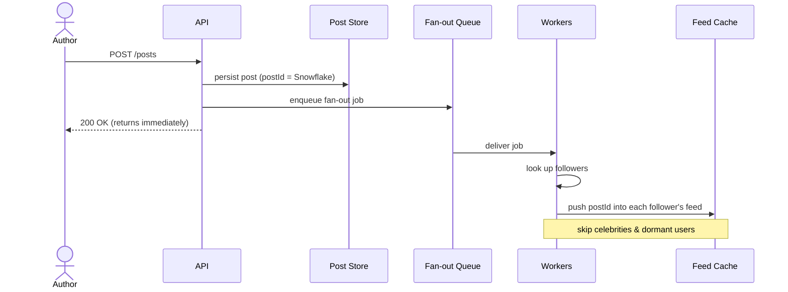

# Problem 3: News Feed (Twitter / Facebook / Instagram)

The canonical fan-out problem. The crux: **fan-out on write vs read**, and the **celebrity
(hot key) problem**. This is a favorite at senior level because the "obvious" answer breaks at
scale.

## Step 1 — Functional requirements
1. **Post** content (text/media).
2. **Follow** other users.
3. **View feed**: a reverse-chronological (or ranked) list of posts from people you follow.
**Non-goals (defer)**: comments/likes mechanics, DMs, full ranking ML, ads.

## Step 2 — Non-functional requirements
- **Read-heavy** (~100:1 reads:writes). Feed views dominate.
- **Low latency feed load** (p99 < ~200ms) — core engagement metric.
- **High availability**, **eventual consistency** OK — a post showing up a few seconds late is
  fine. AP system.
- **High fan-out**: one post by a popular user reaches millions of feeds.

## Step 3 — Capacity estimation
300M MAU → **150M DAU**; 2 posts/user/day, 100 feed-reads/user/day (from
`fundamentals/01`):
- Write ≈ **~3.5K posts/s** (peak ~10K). Read ≈ **~175K feed reads/s** (peak ~500K).
- Fan-out volume: avg followers × posts/day. With avg ~200 followers → 300M posts/day × 200 =
  **60B feed-entry writes/day** if fan-out-on-write — large but it's cheap appends. Celebrities
  with 100M followers blow this up → the core problem.

## Step 4 — API
```
POST /posts            { content, media? }            -> { postId }
POST /follow           { targetUserId }
GET  /feed?cursor=...&limit=20                          -> { posts[], nextCursor }
```
Cursor-based pagination (feeds change constantly; offset is wrong).

## Step 5 — High-level design & the central decision



### Two models for building a feed

**Fan-out on write (push)** — when a user posts, **push** the post ID into the precomputed
feed (timeline) of every follower (stored in a cache, e.g. Redis list per user).
- **Read** = just read your precomputed feed → **very fast reads**. 
- **Write** = expensive: one post → N feed inserts (N = follower count).
- **Great for read-heavy**, normal users. **Terrible for celebrities** (one post = millions of
  writes — the "fan-out storm").

**Fan-out on read (pull)** — store posts per author. When a user opens their feed, **pull**
recent posts from everyone they follow and merge them on the fly.
- **Write** = cheap (one insert). **Read** = expensive (gather from many authors, merge-sort).
- **Great for users who follow many / for celebrities**; bad for the common fast-read case.



### The hybrid (the senior answer)
- **Fan-out on write for normal users** (precompute feeds → fast reads for the 99%).
- **Fan-out on read for celebrities** (don't push their posts to millions; instead, when a user
  loads their feed, **merge** their precomputed feed with a live pull of the few celebrities
  they follow).
- This caps write amplification while keeping reads fast. Define "celebrity" by a follower
  threshold.



## Step 6 — Deep dives

### Data model & stores



- **Posts**: `{ postId (Snowflake, time-sortable), authorId, content, mediaUrls, createdAt }`
  in a sharded store (Cassandra/DynamoDB or sharded SQL), **sharded by postId/authorId**.
- **Social graph**: `follows(followerId, followeeId)` — sharded by followerId for "who I follow"
  and a reverse index by followeeId for "my followers" (needed for fan-out). A graph DB or a
  well-indexed KV both work.
- **Feed/timeline cache**: per-user list of recent postIds in **Redis** (capped, e.g. last
  ~800). Store IDs, not full posts → small; hydrate post content from cache/DB at read time.
- **Media**: blob store (S3) + **CDN**. Never put media bytes in the feed store.

### Fan-out pipeline



- Posting enqueues a fan-out job to a **queue/Kafka**; **workers** look up followers and push
  the postId into each follower's Redis feed. Async → posting returns instantly; absorbs spikes.
- Workers are idempotent (at-least-once). Dead-letter failed fan-outs.

### Hydration
Feed read returns postIds → batch-fetch post objects from a **post cache** (Redis), falling
back to DB. Multi-get to minimize round trips. Authors' profile data similarly cached.

### Ranking (if asked)
Reverse-chron is the baseline. Ranked feed = score posts by a model (recency, affinity,
engagement). Practically: fetch a candidate set, score, sort. Keep scoring off the critical
path or precompute/cache scores. Acknowledge it's a whole ML system; don't rabbit-hole.

### Pagination
Cursor = the last seen postId/timestamp (postIds are time-sortable via Snowflake) → stable
pagination over a changing feed.

## Step 7 — Bottlenecks & failure modes
- **Celebrity fan-out storm** → solved by the hybrid (pull for celebrities). The signature
  insight of this problem.
- **Hot feeds / hot posts** → cache + replicate hot keys; CDN for viral media.
- **Fan-out lag** → during spikes the queue backs up; feeds are eventually consistent (fine).
  Monitor consumer lag; autoscale workers.
- **Inactive users** → don't precompute feeds for users who never log in (wasted writes);
  compute on read for dormant users, push only for active ones. Big efficiency win.
- **Feed store growth** → cap timelines (keep recent N); older posts fetched on demand.
- **New follow** → backfill the follower's feed with the followee's recent posts (async).
- **Thundering herd at peak** (everyone opens app at 8am) → caches + replicas + graceful
  degradation (serve slightly stale feed).

## Key takeaways
- The decision is **push vs pull**, and the right answer is a **hybrid** keyed on the
  **celebrity/hot-key problem**.
- Store **postIds** in feeds (not content); hydrate from a post cache; media on CDN.
- Fan-out is **async via a queue**; skip fan-out for dormant users and celebrities.
- Eventual consistency is acceptable and is what makes the whole thing scale.
