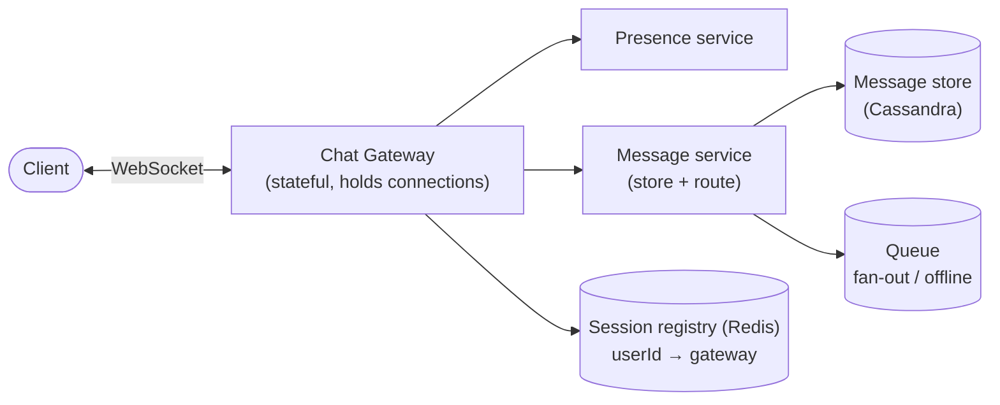
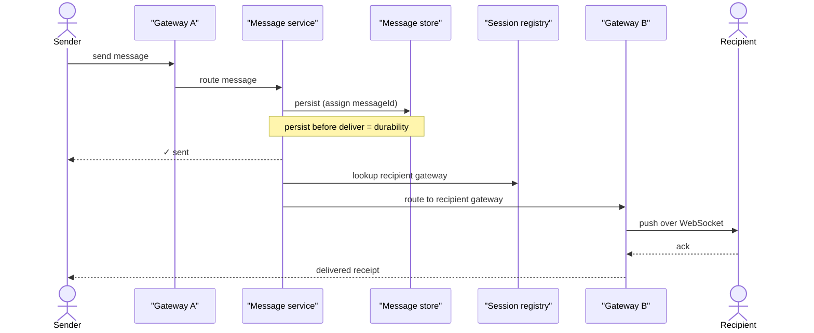
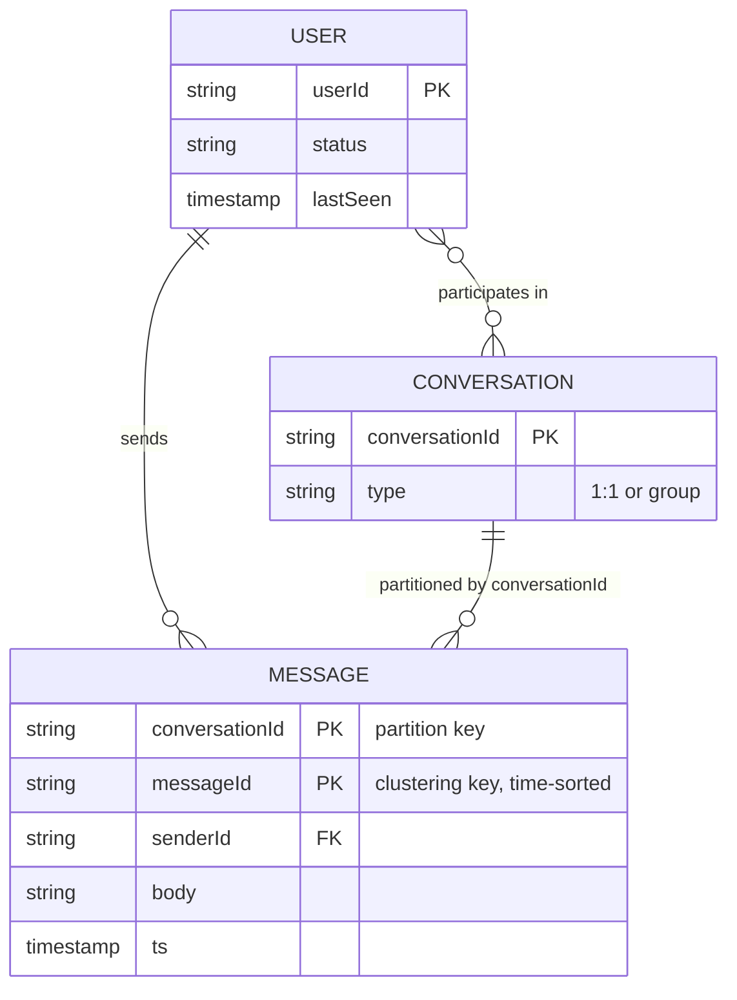

# Problem 4: Chat System (WhatsApp / Messenger / Slack)

Tests real-time delivery, **stateful connections**, presence, and message ordering/durability.
The crux: **persistent connections + the delivery pipeline + per-conversation ordering.**

## Step 1 — Functional requirements
1. 1:1 messaging (real-time send/receive).
2. Group messaging.
3. Online/last-seen **presence**.
4. **Delivery receipts** (sent / delivered / read).
5. Message history / offline delivery (deliver when recipient reconnects).
**Non-goals (defer)**: voice/video calls, E2E encryption details (mention it), media specifics.

## Step 2 — Non-functional requirements
- **Low latency** real-time delivery (sub-second).
- **High availability**; **durability** — messages must not be lost.
- **Ordering** within a conversation (messages appear in send order).
- **Consistency**: per-conversation ordering matters; global ordering does not.
- Scale: hundreds of millions of concurrent **persistent connections**.

## Step 3 — Capacity estimation
500M DAU, ~40 messages/user/day:
- **20B messages/day** ≈ **~230K messages/s** avg, peak ~1M/s.
- **Concurrent connections**: tens to hundreds of millions held open simultaneously → the
  defining constraint. One server holds ~10K–100K connections → need thousands of gateway nodes.
- **Storage**: 20B msgs/day × ~300 B ≈ **~6 TB/day** → tiered retention; media to blob store.

## Step 4 — Connection model & API
- **WebSocket** (or long-lived TCP / MQTT on mobile) for bidirectional real-time push. Polling
  can't scale to this latency/volume. Mobile uses push notifications (APNs/FCM) when the app is
  backgrounded.
```
WS connect (auth)  → server registers {userId → connection, gatewayNode}
send:    { tempId, conversationId, toUserId|groupId, body }
recv:    server pushes { messageId, conversationId, from, body, ts }
receipts: delivered/read events flow back the same way
```

## Step 5 — High-level design


### Send path (1:1)
1. Sender's gateway receives the message over its WebSocket.
2. **Message service persists it first** (durability) → assign a `messageId` (Snowflake,
   time-ordered) and store it. Ack the sender (✓ sent).
3. Look up the recipient's connection via the **session registry** (`userId → gateway node`,
   kept in Redis).
4. If online → route to that gateway → push over the recipient's WebSocket. Recipient's client
   acks → emit **delivered** receipt back to sender.
5. If offline → the message is already persisted; deliver on reconnect (and trigger a push
   notification).



### Why persist before delivering
Durability: the message survives even if the recipient is offline or a gateway crashes
mid-delivery. The store is the source of truth; the WebSocket is just transport.

## Step 6 — Deep dives

### Stateful gateways & the session registry
- Gateways are **stateful** (they hold live connections) — the exception to "keep servers
  stateless." A **service discovery / registry** (Redis) maps each online `userId` → the gateway
  node holding their connection, so the message service knows where to route.
- A **message broker / internal pub-sub** (Kafka/Redis) connects gateways: sender's gateway
  publishes to the recipient's gateway. Avoids N×N direct connections between gateways.

### Data model & store
- **Messages**: `{ conversationId (partition key), messageId (clustering key, time-sorted),
  senderId, body, ts }`. **Partition by `conversationId`** so a conversation's messages are
  co-located and naturally **ordered within the partition** (Snowflake/sequence as clustering
  key). This single choice gives per-conversation ordering for free.
- **Wide-column store (Cassandra/HBase)**: huge write throughput, time-ordered reads of a
  conversation, horizontal scale → ideal here.
- **Per-user inbox / offline queue**: a list of undelivered messageIds per recipient, drained
  on reconnect.



### Ordering
Per-conversation ordering via the time-sortable clustering key (and a per-conversation
sequence). Don't attempt global ordering — unnecessary and unscalable. Clients sort by
messageId; use the client `tempId` to dedupe and reconcile the optimistic local message with
the server-assigned `messageId`.

### Group chat
- Small groups: fan out the message to each member (look up each member's gateway, push). Store
  once per conversation; deliver to each online member; queue for offline members.
- Large groups (Slack channels, broadcast): more like the **feed fan-out** problem — consider
  fan-out-on-read for very large groups to avoid write amplification, and read receipts become
  aggregate, not per-user.

### Presence
- Client sends **heartbeats** over the WebSocket; gateway updates a **presence store** (Redis)
  with `userId → {status, lastSeen}` and a TTL. Missed heartbeats / disconnect → mark offline
  after a grace period.
- **Don't broadcast every presence change to everyone** (O(N²) storm). Push presence only to a
  user's active contacts / open conversations, and/or fetch on demand when opening a chat.
  Presence is the classic scaling trap in this problem.

### Delivery receipts
Sent (persisted) → Delivered (recipient device acked) → Read (recipient opened). Each is an
event flowing back to the sender via the same pipeline; store latest state per message/user.

### Offline delivery & push
Persisted messages + per-user offline queue → delivered on reconnect. While offline/backgrounded,
trigger **APNs/FCM** push notifications. On reconnect, client syncs from its last-seen messageId.

### Media & E2E encryption
Media → upload to **blob store**, send a reference/URL over chat, serve via **CDN**. For E2E
(Signal protocol): the server only relays ciphertext and can't read content — note it changes
search/receipts but not the transport architecture.

## Step 7 — Bottlenecks & failure modes
- **Connection scaling** → thousands of gateways; consistent-hash users to gateways; the
  registry tracks placement. This is the dominant cost.
- **Gateway crash** → clients auto-reconnect (to another gateway); registry updates; undelivered
  messages are safe in the store/queue.
- **Thundering reconnect** after a gateway/region failure → jittered reconnect backoff to avoid
  a stampede.
- **Hot conversation** (huge group) → fan-out-on-read + rate-limit; aggregate receipts.
- **Presence storms** → scope presence to contacts/active chats only.
- **Exactly-once feel** → at-least-once delivery + client dedup by messageId.

## Key takeaways
- WebSockets + **stateful gateways** + a **session registry** (userId→node) is the backbone.
- **Persist before deliver** for durability; the store is the source of truth.
- **Partition messages by conversationId** → co-location + free per-conversation ordering.
- **Presence and large-group fan-out are the scaling traps** — scope them, don't broadcast to all.
