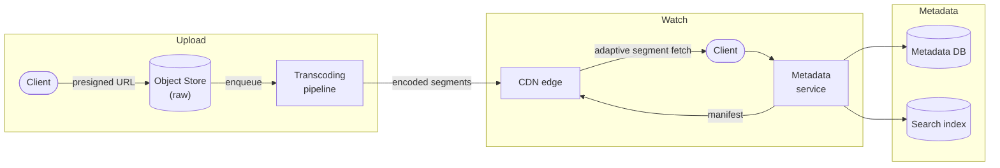
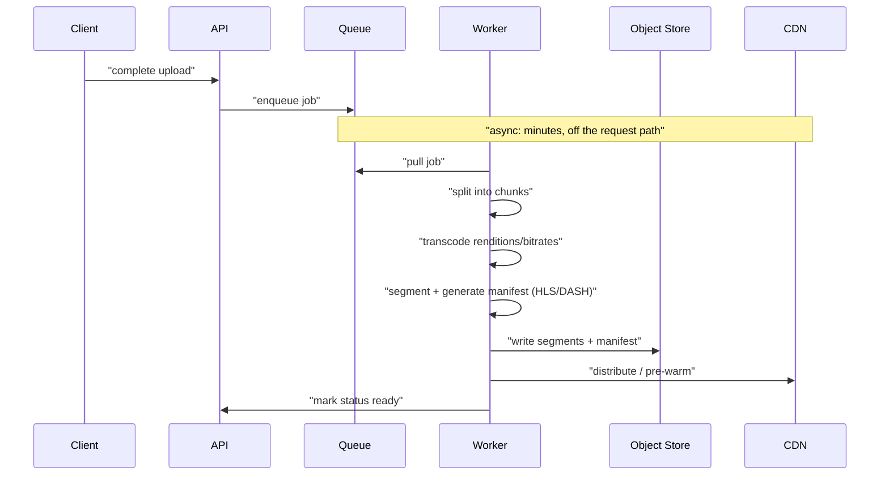
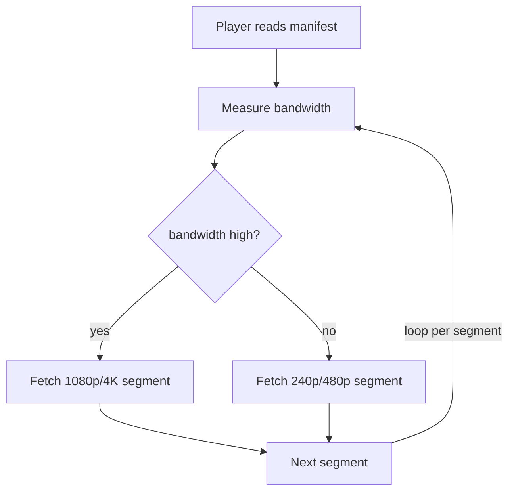

# Problem 7: Video Streaming (YouTube / Netflix)

Tests blob storage at scale, the **CDN**, async processing pipelines, and adaptive delivery.
The crux: **the upload→transcode pipeline and CDN-based delivery**; the database is almost a
footnote.

## Step 1 — Functional requirements
1. **Upload** a video.
2. **Stream/watch** a video (smooth playback across devices/bandwidths).
3. Search / browse (metadata).
4. View counts, likes/comments (mention; defer detail).
**Non-goals (defer)**: recommendations ML, live streaming (note it's a different pipeline), DRM
details, monetization.

## Step 2 — Non-functional requirements
- **Read-heavy by orders of magnitude** (views ≫ uploads, ~1000:1+).
- **High availability** and **smooth, low-buffering playback** — the core quality metric.
- **Massive storage & bandwidth** — video dominates everything.
- **Eventual consistency** fine for metadata/counts; uploads can be processed async (a new video
  taking minutes to be ready is acceptable).

## Step 3 — Capacity estimation
- Say 500 hours uploaded/min (YouTube-scale) → storage grows **petabytes/day**; with multiple
  encoded renditions per video, multiply by ~5–8×.
- **Bandwidth is the dominant cost.** Billions of watch-hours → terabits/sec egress → this is
  why a **CDN is non-negotiable** (and why you cache aggressively at the edge).
- View/metadata writes are comparatively tiny.

## Step 4 — API
```
POST /videos (initiate upload)  -> { uploadUrl (presigned), videoId }
                                   (client uploads bytes directly to blob store, chunked/resumable)
POST /videos/{id}/complete       -> triggers processing
GET  /videos/{id}                -> metadata + manifest URL (HLS/DASH)
GET  /watch/{id}                 -> player loads manifest → fetches segments from CDN
```
Uploads go **directly to object storage via presigned URLs** (chunked, resumable) — don't proxy
gigabytes through your app servers.

## Step 5 — High-level design


## Step 6 — Deep dives

### Storage
- **Raw uploads + all encoded renditions** live in an **object store (S3/GCS-like)** — built for
  huge, immutable blobs, cheap, durable (replicated), with lifecycle tiering (hot → cold/archive
  for rarely watched videos to cut cost).
- **Metadata** (title, description, owner, status, rendition/manifest URLs, counts) in a
  database — modest size; sharded SQL or a wide-column store. The blobs are the scale problem,
  not the metadata.

### The transcoding pipeline (the heart of the upload side)
- Raw upload triggers an **async pipeline** (queue + worker fleet — this is embarrassingly
  parallel batch work):
  1. **Validate** and split the video into chunks (process chunks in parallel for speed).
  2. **Transcode** into multiple **resolutions/bitrates** (240p…4K) and **codecs** (H.264, VP9,
     AV1) for device/bandwidth compatibility.
  3. **Segment** each rendition into small chunks (e.g. 2–10s) and generate a **manifest**
     (HLS `.m3u8` / MPEG-DASH `.mpd`) listing segments per rendition.
  4. Generate thumbnails, extract captions, run content/safety checks.
  5. Write outputs to blob store; **pre-warm/distribute to CDN**; flip status to **ready**.
- It's **async** because transcoding takes minutes and is compute-heavy → never on the request
  path. Use a job queue (DAG of steps), autoscale workers, make steps **idempotent** and
  retryable (DLQ for failures).



### Delivery: CDN + adaptive bitrate streaming (the heart of the watch side)
- **CDN is the core of delivery.** Segments are cached at edge locations near users; the vast
  majority of bytes are served from the edge, not origin. This is what makes global streaming
  feasible and cheap-ish.
- **Adaptive Bitrate Streaming (ABR)** via HLS/DASH: the player fetches the manifest, then
  **picks the rendition matching current bandwidth/CPU**, switching segment-by-segment as
  conditions change → smooth playback, minimal buffering on flaky networks. The server just
  serves segments; the **client drives adaptation**.



- **Cache strategy**: popular videos pinned/pre-pushed to edges; long-tail pulled on first
  request (origin-pull) and cached. Hot new releases (Netflix) are pushed proactively.

### Metadata, search, counts
- Metadata service backed by DB + cache. **Search** via a dedicated index (Elasticsearch).
- **View counts / likes** are high-volume, tolerant of approximation → **async aggregation**
  (emit events → stream processing → periodic count updates); don't update a row per view
  synchronously. Eventual consistency is fine.

### Resumable uploads
Chunked + resumable (upload by byte ranges; resume after a network drop) — important for large
files on unreliable connections.

## Step 7 — Bottlenecks & failure modes
- **Bandwidth/cost** → CDN offload + tiered storage + efficient codecs (AV1 saves bytes at CPU
  cost). Cost is a primary design axis here.
- **Transcoding backlog** → autoscale the worker fleet on queue depth; prioritize (premium /
  short videos first); it's async so backlog delays readiness, not availability.
- **Thundering herd on a viral/new release** → pre-warm CDN; edge absorbs it.
- **Pipeline step failure** → retries + DLQ; idempotent steps; a failed rendition doesn't lose
  the raw upload.
- **Partial availability** → serve lower renditions if a high-res encode isn't ready yet.
- **Hot origin** → CDN shields it; multi-tier CDN (edge → regional → origin).

## Key takeaways
- **Object store for blobs + CDN for delivery + async transcoding pipeline** is the whole game;
  the relational DB is minor.
- **Adaptive bitrate streaming (HLS/DASH), client-driven**, gives smooth playback across networks.
- Uploads go **direct to blob storage (presigned, resumable)**; transcoding is **async, parallel,
  idempotent**.
- **Bandwidth and storage cost are first-class design constraints** — CDN offload and tiering are
  the levers.
