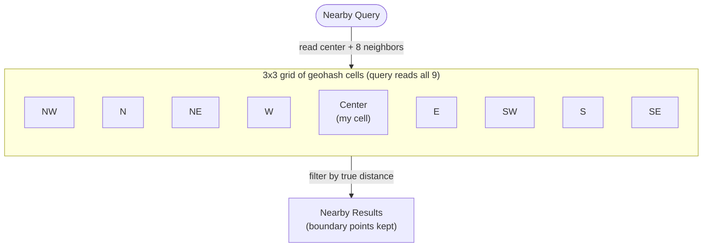
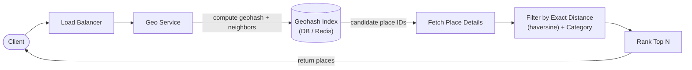

# Problem 8: Proximity / Geo Service (Yelp nearby, Uber, "Find Friends")

Tests **geospatial indexing** — the one problem where a normal index doesn't work. The crux:
**how to index 2D location data so "what's near me" is fast**, plus (for Uber) handling
high-frequency location updates.

## Step 1 — Functional requirements
Two flavors — pick one and state it:
- **Static places (Yelp)**: given a location + radius, return nearby businesses.
- **Moving entities (Uber/Find Friends)**: drivers/users update location frequently; match a
  rider to nearby drivers in real time.
Cover static first, then extend to moving.
**Non-goals (defer)**: routing/ETA, pricing, the matching/dispatch algorithm details.

## Step 2 — Non-functional requirements
- **Low latency** proximity queries (< ~100–200 ms).
- **High availability**; **eventual consistency** acceptable for "nearby" (a place appearing a
  moment late is fine).
- For moving entities: **very high write throughput** (millions of drivers pinging location
  every few seconds) — a distinct, hard sub-problem.
- Read-heavy for static; write-heavy for moving.

## Step 3 — Capacity estimation
- **Yelp**: ~200M places, modest write rate (places rarely move), high read QPS for "nearby."
  Data fits comfortably; the challenge is **query efficiency**, not volume.
- **Uber**: ~few million active drivers × a location ping every ~4s → **~millions of location
  writes/sec**. Plus rider queries. The **write firehose** is the defining constraint.

## Step 4 — API
```
GET  /search?lat={}&lng={}&radius={}&category={}   -> { places[] }      # static
POST /location  { driverId, lat, lng }                                   # moving: ping
GET  /nearby?lat={}&lng={}&radius={}                -> { drivers[] }     # moving: match
```

## Step 5 — Why naive indexing fails (the central insight)
A B-tree index on `lat` and `lng` separately can't answer "within radius" efficiently — you'd
range-scan a latitude band **and** a longitude band and intersect huge sets. You need a **1D
index over 2D space** that preserves locality (nearby points → nearby keys). That's the whole
problem. The solutions all map 2D → 1D (or recursively partition space).

## Step 6 — Deep dives: geospatial indexing options

### 1. Geohash (recommended default — simple & widely used)
- Recursively divide the world into a grid; encode each cell as a **base32 string**. Longer
  prefix = smaller (more precise) cell. **Nearby locations share a common prefix.**
- Store each place with its geohash; **index the geohash string** (a normal B-tree/sorted
  index works now). "Nearby" = **prefix match** at a chosen precision.
- **Edge case to mention**: points near a cell boundary can be physically close but in different
  cells (different prefixes). Fix: **also query the 8 neighboring cells** and merge. (Also: the
  prefix-distance relationship isn't perfectly monotonic — querying neighbors handles it.)
- Choose precision (cell size) by the search radius. Simple, works with any KV/SQL store, easy
  to shard by geohash prefix.

A "nearby" query reads the **center cell plus all 8 neighbors**, then filters by true distance —
so a point just across a cell boundary isn't missed:



### 2. Quadtree (in-memory, adaptive density)
- A tree that recursively splits a region into 4 quadrants until each leaf holds ≤ K points.
- **Adapts to density**: dense areas (downtown) subdivide more; sparse areas stay coarse →
  balanced leaves. Great for uneven distributions.
- Held **in memory** for speed; query = descend to the region, collect nearby leaves. Rebuild /
  update on changes. More complex than geohash; better for highly skewed density.

### 3. Google S2 (Hilbert curve)
- Maps the sphere to a 1D index via a **Hilbert space-filling curve** (strong locality). Handles
  sphere geometry and regions well; used by Google/Tinder. More sophisticated; mention as the
  production-grade option.

> Recommended: **geohash** for a clean, shardable, store-agnostic answer (and remember the
> **neighbor-cell** query). Mention **quadtree** for density adaptivity and **S2** as the
> heavyweight option. Naming the tradeoffs is the senior signal.

### Static design (Yelp)

- Places stored with geohash; query computes the caller's geohash + neighbors, fetches
  candidates, then filters by exact distance (haversine) and category, ranks, returns top N.
- **Cache** popular area queries; place data changes rarely → highly cacheable. **Shard by
  geohash prefix** (region) — but watch for **dense-region hotspots** (Manhattan ≫ rural); use
  finer sharding or quadtree-style adaptivity there.

### Moving entities (Uber) — the hard extension
- **Write firehose**: millions of location pings/sec. Don't write each ping to a disk DB →
  store **current location in memory (Redis / in-memory geo index)**, updated in place. Redis
  has native geo commands (geohash-backed) — `GEOADD` / `GEOSEARCH`.
- **Reduce write load**: clients ping less often when stationary; **batch/aggregate** updates;
  only the latest location matters (overwrite, don't append).
- **Sharding the live index by region/geohash** so each shard handles its geographic area's
  writes and queries; rebalance hot regions. The location index is ephemeral (rebuildable from
  pings) so it can be AP/in-memory.
- **Matching**: rider query → find candidate drivers in nearby cells (current + neighbors) →
  filter (available, capacity) → rank by distance/ETA → dispatch. Keep dispatch logic separate.
- **Stale entries**: drivers that stop pinging expire via TTL (they went offline).

```mermaid
sequenceDiagram
    participant Driver
    participant Loc as "Location Service"
    participant Redis as "In-Memory Geo Index (Redis)"
    participant Geo as "Geo Service"
    participant Rider

    Driver->>Loc: "ping {driverId, lat, lng} (every ~4s)"
    Loc->>Redis: "GEOADD (overwrite latest)"
    Note over Driver,Redis: "Write firehose — millions of pings/sec;<br/>only latest location matters, so overwrite (don't append)"
    Rider->>Geo: "GET /nearby (lat, lng, radius)"
    Geo->>Redis: "GEOSEARCH nearby cells"
    Redis-->>Geo: "candidate drivers"
    Geo->>Geo: "filter (available) + rank by distance/ETA"
    Geo-->>Rider: "dispatch nearest driver"
```

## Step 7 — Bottlenecks & failure modes
- **Dense-region hotspots** → adaptive cell sizing (quadtree) or finer geohash precision +
  shard splitting in hot areas. The recurring geo pitfall.
- **Boundary misses** → always query neighboring cells, filter by true distance.
- **Write firehose (Uber)** → in-memory store, overwrite-latest, client-side ping throttling,
  regional sharding.
- **Index staleness for moving entities** → short TTLs; eventual consistency is acceptable
  (a driver a few seconds stale is fine).
- **Region shard failure** → replicate; the live index is rebuildable from incoming pings.

## Key takeaways
- The core insight: **ordinary indexes can't do 2D proximity — you need a geospatial index**
  that maps 2D→1D with locality (**geohash**), or partitions space (**quadtree / S2**).
- **Geohash + neighbor-cell queries + exact-distance filtering** is the clean default.
- For **moving entities**, the location stream is a **write firehose** → in-memory, overwrite,
  region-sharded; eventual consistency and TTLs are your friends.
- **Dense-area hotspots** are the signature scaling challenge — handle them explicitly.
