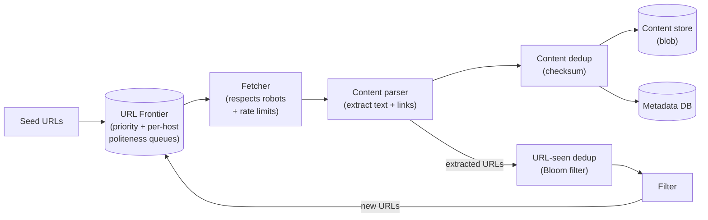
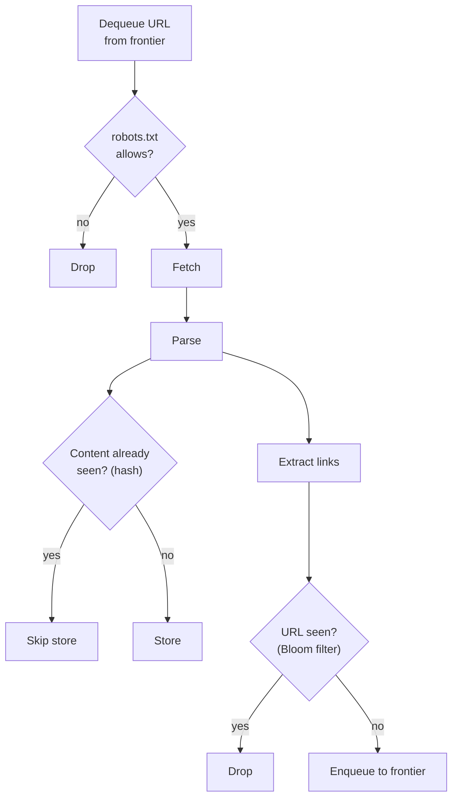
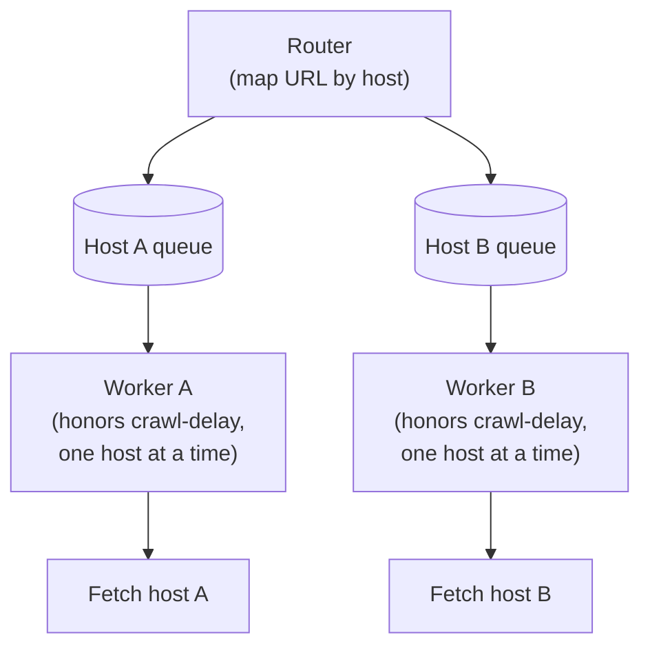

# Problem 10: Web Crawler

Tests a large-scale **BFS over an unbounded graph**, queue-driven pipelines, politeness, and
deduplication. The crux: **the frontier (URL queue) with politeness, and dedup at massive scale.**

## Step 1 — Functional requirements
1. Start from seed URLs; **fetch pages**, extract links, follow them (graph traversal).
2. **Store** page content (for indexing / archival).
3. **Don't re-crawl** the same URL endlessly; refresh periodically.
4. Be **polite** (respect `robots.txt`, rate-limit per domain).
**Non-goals (defer)**: ranking/indexing internals, JS rendering (note it's a heavier variant).

## Step 2 — Non-functional requirements
- **Scale**: billions of pages → must be massively parallel and distributed.
- **Politeness**: never hammer a single site; obey `robots.txt` and crawl-delay.
- **Robustness**: handle malformed HTML, slow/dead servers, redirect loops, crawler traps.
- **Freshness**: re-crawl changing pages; prioritize important pages.
- **Extensibility**: pluggable for new content types.
- Eventual consistency is fine; throughput matters more than latency per page.

## Step 3 — Capacity estimation
1B pages/month → **~400 pages/s** sustained (peak higher). Page ~100 KB → **~100 TB/month**
raw content (compress + tier). URL metadata for billions of URLs (dedup set) is itself large →
needs a scalable store / Bloom filter.

## Step 4 — Interfaces (internal pipeline, not a public API)
Components communicate via **queues**. The "API" is the stage contract: URL in → fetched
content + extracted URLs out.

## Step 5 — High-level design (pipeline of stages connected by queues)

This is fundamentally **BFS**: the frontier is the queue, fetched links are neighbors pushed back.

## Step 6 — Deep dives

### The URL frontier (the heart)
- A set of queues managing **what to crawl next**, balancing two concerns:
  - **Priority**: important/fresh pages first (by PageRank-ish score, update frequency, domain
    importance). A multi-level priority structure.
  - **Politeness**: never crawl one host concurrently / too fast. Map each **host → its own
    queue**, and a worker handles one host at a time with a crawl-delay. This per-host queueing
    is the classic politeness mechanism.
- Frontier is distributed and persistent (survives restarts; billions of pending URLs).

### Deduplication (two kinds — both critical at scale)
- **URL dedup**: have we already seen/scheduled this URL? A massive set of seen URLs. Use a
  scalable store + a **Bloom filter** in front to cheaply reject already-seen URLs (probabilistic,
  memory-efficient; false positives just mean occasionally skipping a new URL — acceptable).
- **Content dedup**: different URLs serving identical content (mirrors, session IDs in URLs).
  Hash the content (e.g. checksum / SimHash for near-duplicates); skip storing duplicates. Saves
  huge storage and avoids redundant crawling.

### Distributing the work
- **Partition by host/domain** across crawler nodes (consistent hashing) so each host is owned by
  one node → politeness is naturally enforced per node, no cross-node coordination per host.
- Stateless fetchers scale horizontally; frontier + dedup state are the shared, partitioned
  components.

### Politeness details
- Parse and cache **`robots.txt`** per host; obey disallow rules and `Crawl-delay`.
- Per-host rate limit / single-connection; exponential backoff on errors.
- Identify with a proper User-Agent.

### Freshness / re-crawl
- Track `lastCrawled` + change frequency per URL; re-enqueue on a schedule (adaptive: pages that
  change often get crawled more). The frontier blends new discovery with re-crawl.

### Traps & robustness
- **Crawler traps** (infinite calendars, dynamically generated link mazes) → cap depth per
  domain, limit URLs per host, detect patterns.
- **Redirect loops** → cap redirects. **Slow/dead servers** → timeouts + backoff. **Malformed
  HTML** → tolerant parser. **DNS** → cache resolutions (DNS can be a bottleneck at this scale).

### Storage
- Raw/compressed page content → **blob store** (immutable, cheap, tiered). Metadata (URL, hash,
  lastCrawled, status) → a scalable DB. Extracted links feed back into the frontier.

## Step 7 — Bottlenecks & failure modes
- **DNS resolution** at scale → dedicated cached DNS resolvers.
- **Frontier hotspots** (one giant site) → per-host caps, fair scheduling across hosts.
- **Dedup set size** → Bloom filter + sharded store; accept tiny false-positive skip rate.
- **Node failure** → frontier/dedup are persistent & partitioned; reassign a failed node's hosts;
  in-flight URLs are re-enqueued (at-least-once → dedup makes re-fetch harmless).
- **Politeness violations** → per-host ownership + queues prevent accidental DDoS of a site.

## Key takeaways
- It's **distributed BFS**: the **URL frontier** is the queue; the design is a **queue-connected
  pipeline** of fetch → parse → dedup → store → extract → re-enqueue.
- The two hard parts are the **frontier (priority + per-host politeness)** and **dedup
  (URL via Bloom filter, content via hashing)** at billions-scale.
- **Partition by host** so politeness is free and work distributes cleanly.
