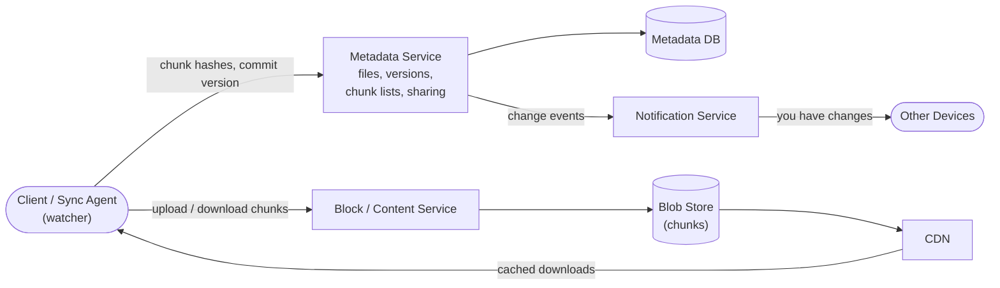
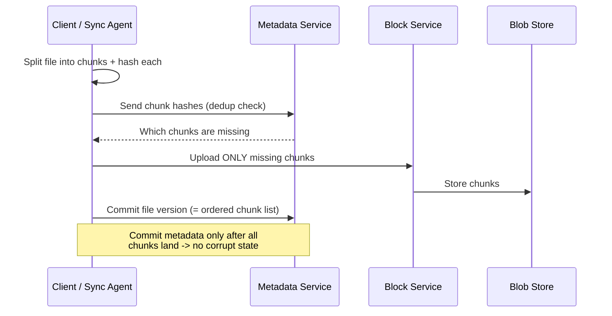
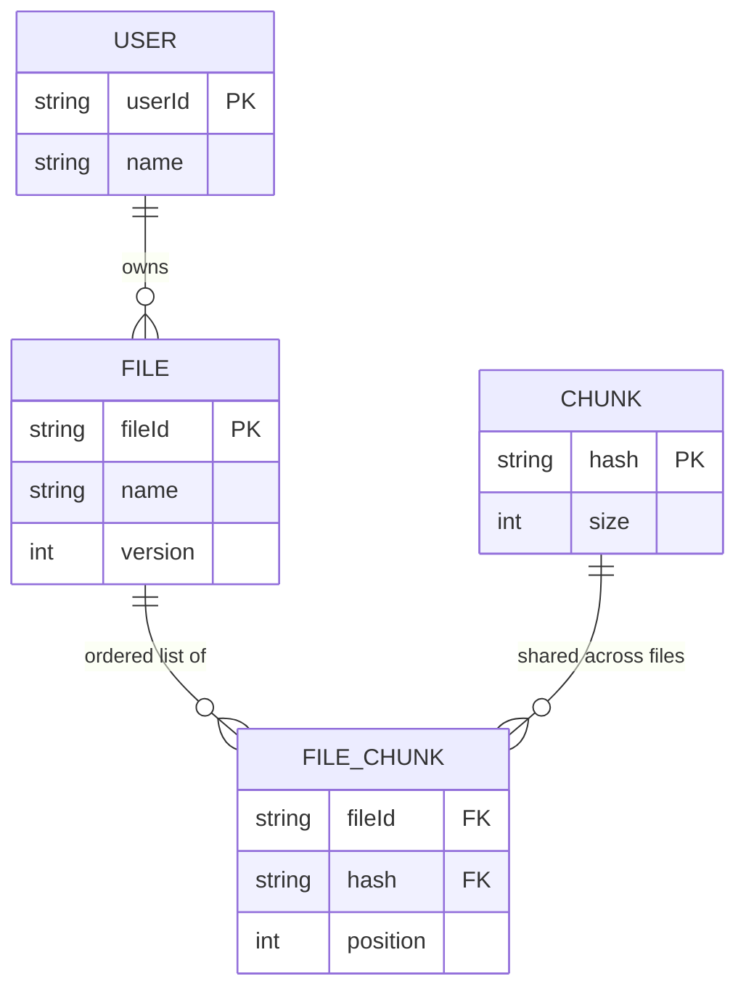

# Problem 11: File Storage & Sync (Dropbox / Google Drive)

Tests blob storage, **sync across devices**, chunking/dedup, and metadata vs content separation.
The crux: **efficient sync (chunking + delta updates) and keeping multiple devices consistent.**

## Step 1 — Functional requirements
1. **Upload / download** files.
2. **Sync** across a user's devices (a change on one appears on others).
3. **Share** files/folders with other users.
4. **Versioning** (file history) and offline edits.
**Non-goals (defer)**: real-time collaborative editing (that's an OT/CRDT problem — note it),
search, previews.

## Step 2 — Non-functional requirements
- **Reliability / durability** — never lose a file (this is the whole product promise).
- **Availability** and reasonable latency.
- **Efficient sync** — don't re-upload a whole file for a small edit; minimize bandwidth.
- **Consistency**: a user must not see a corrupt/half-synced file; metadata must be consistent.
  Content can be eventually consistent across devices.
- Scale: hundreds of millions of users, exabytes of data.

## Step 3 — Capacity estimation
500M users × avg 10 GB stored → **~5 EB** total → object storage with dedup + tiering. Read:write
moderate; sync metadata operations are frequent and small (the chatty part). Bandwidth savings
from chunk-level dedup/delta are a major cost lever.

## Step 4 — API
```
POST /files (init)          -> chunk plan / which chunks already exist (dedup check)
PUT  /chunks/{hash}          -> upload a content chunk (to blob store, often presigned)
POST /files/commit           { fileId, chunkList, version } -> create/update file metadata
GET  /files/{id}             -> metadata + chunk list -> download chunks
GET  /changes?cursor=...     -> delta of changes since cursor (for sync)
```

## Step 5 — High-level design — separate metadata from content

The **key architectural split**: **metadata** (small, transactional, consistency-critical → a
database) vs **file content** (huge, immutable blobs → object store). They scale and behave
completely differently.

## Step 6 — Deep dives

### Chunking + content-addressed dedup (the heart of efficiency)
- Split each file into **fixed or content-defined chunks** (e.g. ~4 MB). Identify each chunk by a
  **hash of its content** (content-addressed storage).
- **Dedup**: before uploading, send chunk hashes; the server returns which already exist (across
  the user — or globally). Only **upload missing chunks**. Identical files/chunks stored once →
  massive storage + bandwidth savings.
- **Delta sync**: editing a small part of a large file only changes a few chunks → upload just
  those. This is why Dropbox feels fast on edits.
- A file = an ordered **list of chunk hashes** in metadata; content is just deduped chunks in the
  blob store.



**Data model** — content-addressed dedup: a `CHUNK` (keyed by content hash) can be referenced by
many files; `FILE_CHUNK` records the ordered list of chunk hashes that make up a file version.



### Sync mechanism
- **Client sync agent** watches the local folder for changes, chunks them, and uploads deltas;
  it also applies remote changes.
- **Detecting remote changes**: a **notification service** (long-poll or WebSocket) tells a
  device "something changed, pull updates," then the device calls `GET /changes?cursor` to fetch
  the **delta** since its last sync cursor. Polling fallback for reliability.
- Each device tracks a **cursor / version vector** of what it has seen → efficient incremental sync.

### Consistency & conflicts
- **Metadata in a transactional DB** keeps file state consistent (a file version commit is atomic
  — only after all chunks are uploaded). A device never sees a file pointing at missing chunks.
- **Conflict resolution**: two devices edit the same file offline → on sync, detect divergent
  versions (version vectors). Common product choice: **keep both** as "conflicted copy" rather
  than silently overwriting (last-write-wins risks data loss). State the tradeoff.
- **Versioning**: keep prior chunk lists → cheap version history (chunks are immutable & shared).

### Storage & durability
- Chunks in **object storage** (replicated across AZs/regions → durability) with **tiering** (cold
  files → cheaper/archival storage). Downloads served via **CDN** for global speed.
- Immutable, content-addressed chunks make caching, dedup, and integrity checks (verify hash)
  trivial.

### Sharing
- Sharing = metadata permission entries on a file/folder; shared users get the same chunk
  references (no copy). Access checks at the metadata service.

## Step 7 — Bottlenecks & failure modes
- **Bandwidth** → chunk-level dedup + delta sync + compression; CDN for downloads.
- **Metadata hotspots** (huge shared folder, many devices) → shard metadata by user/file;
  cache; batch change notifications.
- **Partial upload / crash** → chunks are idempotent (content-addressed); commit metadata only
  after all chunks present → no corrupt state; resume by re-checking which chunks exist.
- **Sync storms / chatty clients** → batch changes, backoff, coalesce notifications.
- **Conflicts** → version vectors + conflicted-copy strategy.
- **Large file** → chunked + resumable; only changed chunks re-sync.

## Key takeaways
- **Separate metadata (DB, transactional, consistency-critical) from content (immutable blobs in
  object store).** The defining decision.
- **Chunking + content-addressed dedup + delta sync** is the efficiency engine — never re-upload
  whole files.
- **Cursors/version vectors + a notification service** drive incremental multi-device sync;
  handle conflicts with conflicted-copies, not silent overwrite.
- Commit metadata only after content lands → no corrupt/half-synced states.
