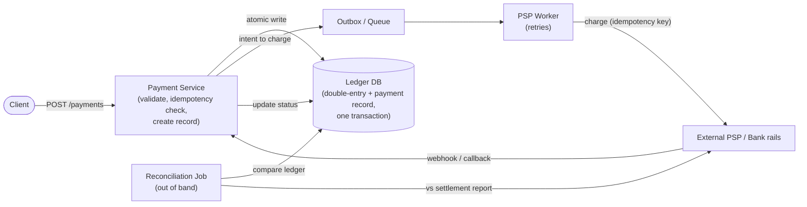
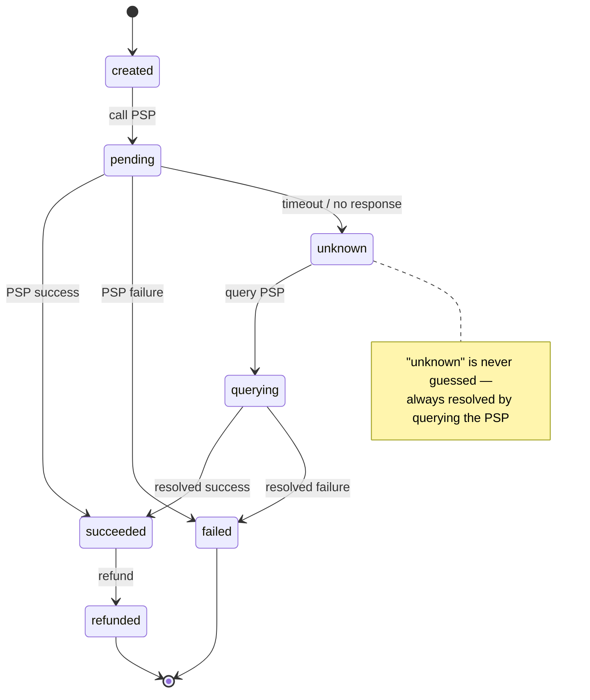

# Problem 12: Payment System

The problem where **correctness beats everything** — money must never be lost, double-charged,
or invented. The crux: **exactly-once semantics via idempotency, consistency, and reconciliation
across unreliable external systems.**

## Step 1 — Functional requirements
1. **Process a payment** (charge a customer, pay a merchant) via a payment service provider (PSP
   like Stripe/Adyen/bank rails).
2. Track **transaction state** (pending → success/failed).
3. **Refunds**.
4. **Ledger** / accounting record of every money movement.
**Non-goals (defer)**: fraud ML detail, multi-currency FX detail, full PCI scope (mention it).

## Step 2 — Non-functional requirements
- **Correctness above all**: **no double charges, no lost payments, no money created/destroyed.**
- **Strong consistency** for money state (this is a **CP**, ACID problem — not eventual).
- **Durability** — a committed payment must survive anything.
- **Auditability** — every state change traceable (compliance/regulatory).
- **Availability** matters, but **correctness wins ties** (fail closed on ambiguity).
- Scale is real but secondary to correctness (payments QPS ≪ feed QPS).

## Step 3 — Capacity estimation
Even a big system: thousands of payments/sec peak — modest vs social systems. **Storage** grows
forever (financial records are retained for years/compliance). The hard part is *guarantees*, not
*throughput*.

## Step 4 — API
```
POST /payments   Idempotency-Key: <uuid>
                 { amount, currency, customerId, merchantId, paymentMethod } -> { paymentId, status }
GET  /payments/{id} -> status
POST /payments/{id}/refund  Idempotency-Key: <uuid> -> { refundId, status }
```
**Idempotency-Key is mandatory** on every money-moving request — this is the single most
important interface decision.

## Step 5 — High-level design


## Step 6 — Deep dives

### Idempotency (the #1 concern)
- Networks fail and clients retry → without protection you double-charge. Every payment request
  carries a client-generated **idempotency key**; the service stores it with the result. A repeat
  with the same key **returns the original result instead of charging again**.
- Internally, calls to the PSP also carry idempotency keys (PSPs support this) so *our* retries
  don't double-charge at their end either. **At-least-once everywhere + idempotency = effective
  exactly-once.**

```mermaid
sequenceDiagram
    participant C as Client
    participant P as Payment Service
    participant PSP as PSP / Bank
    C->>P: POST /payments (Idempotency-Key)
    alt key already seen
        P-->>C: return original result (no re-charge)
    else new key
        P->>P: persist pending record + ledger entry (one txn)
        Note over P: persist before calling PSP;<br/>at-least-once + idempotency = effective exactly-once
        P->>PSP: charge (with idempotency key)
        PSP-->>P: result (succeeded / failed)
        P->>P: update status
        P-->>C: return result
    end
```

### State machine & durability
- Model a payment as an explicit **state machine**: `created → pending → (succeeded | failed) →
  [refunded]`. Only legal transitions allowed; persist every transition.


- **Never lose in-flight state**: persist *before* calling the PSP, so a crash mid-call leaves a
  recoverable `pending` record you can resolve (query the PSP for the real outcome) rather than a
  lost payment.

### The ledger (double-entry bookkeeping)
- Record money movement as **double-entry**: every transaction is balanced debits and credits
  across accounts (customer, merchant, fees, platform). Sum of all entries = 0 → an invariant you
  can continuously verify. This is the auditable source of truth.
- Ledger writes are **append-only / immutable**; corrections are new compensating entries, never
  edits. Strong consistency / ACID — use a relational DB with transactions.

### Consistency across steps
- The payment record + ledger entry should be written **atomically** (one DB transaction) so they
  can't diverge.
- Talking to the external PSP can't be in that DB transaction (it's a remote call) → use the
  **outbox pattern**: commit "intent to call PSP" in the same transaction, then a worker relays it
  to the PSP and records the result. Guarantees we never charge without a durable record, and
  never have a record without attempting the charge.
- For multi-step flows (e.g. hold → capture, or split payments) use a **saga** with compensating
  actions (void/refund) rather than a distributed 2PC.

### Handling PSP responses & the "unknown" case
- PSP success/failure callbacks arrive via **webhooks** (asynchronous). Process them idempotently
  (a webhook may be delivered more than once).
- **The dangerous case is "unknown"** (timeout, no response): never assume failure and never
  assume success. Leave as `pending`, then **query the PSP** (idempotency key ensures you don't
  double-charge) to resolve the true state. Designing for this ambiguity is the senior signal.

### Reconciliation (defense in depth)
- Independently, a scheduled job compares **our ledger against the PSP's settlement report**.
  Discrepancies (we think succeeded, they don't, or vice-versa) are flagged and corrected. Assume
  things *will* drift; reconciliation is the safety net that catches what live logic misses.

### Security / compliance
- **PCI-DSS**: don't store raw card numbers — **tokenize** via the PSP. Encrypt sensitive data;
  least-privilege access; full audit log. Mention it; don't rabbit-hole.

## Step 7 — Bottlenecks & failure modes
- **Double charge** → idempotency keys end to end. *The headline defense.*
- **Crash mid-payment** → persist before calling PSP; `pending` + PSP query resolves it.
- **PSP timeout/unknown** → treat as pending, reconcile via query; never guess.
- **Duplicate webhooks** → idempotent webhook processing.
- **Ledger/record divergence** → atomic write (outbox) + reconciliation job.
- **PSP outage** → retries with backoff; queue payments; possibly failover to a backup PSP.
- **Partial failure in multi-step** → saga compensations (void/refund).

## Key takeaways
- **Correctness > availability > latency** here. It's a strongly-consistent, ACID, fail-closed
  system — the opposite posture from a feed.
- **Idempotency keys end-to-end** give effective exactly-once over at-least-once rails.
- **Double-entry, append-only ledger** is the auditable source of truth; balance = 0 is the invariant.
- **Persist before calling the PSP, treat "unknown" as pending, and reconcile out of band** —
  designing for ambiguous failure is what separates a senior answer.
