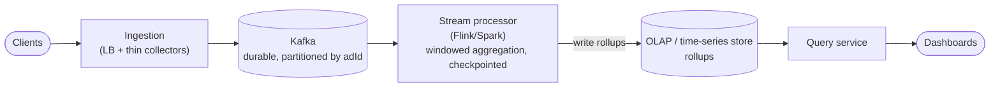
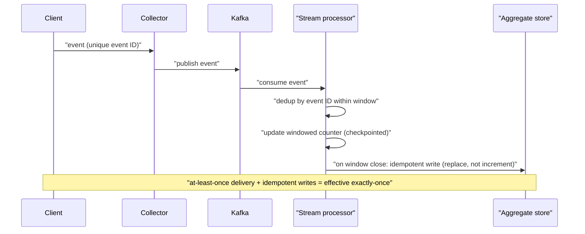
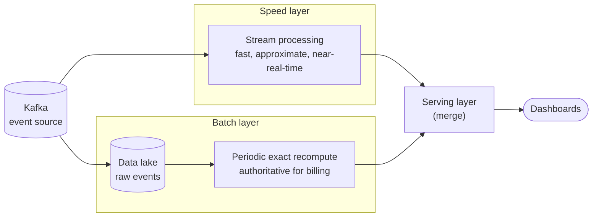

# Problem 13: Ad Click Aggregator / Real-Time Analytics

Tests **stream processing**, the batch-vs-stream tradeoff, idempotent counting, and handling
enormous write volume with approximate-vs-exact tension. The crux: **aggregating a firehose of
events into queryable metrics in near-real-time, accurately, at scale.**

## Step 1 — Functional requirements
1. **Ingest** ad click/impression events at massive scale.
2. **Aggregate** metrics (clicks per ad per minute/hour, by region/campaign, etc.).
3. **Query** aggregates in near-real-time (dashboards) and accurately (billing).
4. Support time-range and dimensional rollups.
**Non-goals (defer)**: ad serving/auction, targeting, fraud ML (note dedup/fraud matters for billing).

## Step 2 — Non-functional requirements
- **Massive write throughput** — millions of events/sec. The defining constraint.
- **Low query latency** on aggregates (dashboards want sub-second).
- **Scalability + availability**.
- **Accuracy tension**: dashboards tolerate approximate/slightly-late numbers; **billing must be
  exact**. → leads to a dual path (see Lambda architecture).
- **Idempotency**: at-least-once ingestion must not over-count (over-counting = over-billing).

## Step 3 — Capacity estimation
1M clicks/s × ~100 B/event ≈ **~100 MB/s ≈ ~8.6 TB/day** raw → can't store-and-scan per query;
must **pre-aggregate**. Aggregates (per ad per minute) are orders of magnitude smaller and fast
to query. Storage tiering for raw events (keep for reprocessing/billing audit, then archive).

## Step 4 — API
```
POST /events   { adId, userId, eventType, ts, dims... }   (ingestion; high volume)
GET  /metrics?adId=&from=&to=&granularity=minute&groupBy=region  -> aggregated counts
```
Ingestion is fire-and-forget-fast; querying hits precomputed aggregates.

## Step 5 — High-level design (stream pipeline + Lambda architecture)


### Why Kafka in the middle
Decouples ingestion from processing, **absorbs spikes**, gives a **durable, replayable** log
(reprocess on bug/late data). Partition by `adId` (or a key) so related events are ordered and
aggregation parallelizes across partitions.

## Step 6 — Deep dives

### Stream aggregation with windows
- The stream processor maintains **windowed counters** (tumbling windows, e.g. per-minute) keyed
  by (adId, dimensions). On window close, flush the aggregate to the serving store.
- **Stateful + checkpointed**: the processor checkpoints its in-flight window state so it can
  recover after a crash without losing or double-counting — the basis of correctness.

### Exactly-once counting (the accuracy crux)

- Ingestion is at-least-once (Kafka redelivery, client retries) → naive counting **over-counts**.
- Achieve effective exactly-once via:
  - **Idempotent events**: each event has a unique ID; dedup within the processing window.
  - **Framework exactly-once**: Flink/Kafka transactions tie consumption + state update + output
    into one atomic step.
  - **Idempotent writes** to the aggregate store (e.g. write "count for window W = X" by replacing,
    not incrementing, so reprocessing a window is safe).

### Lambda architecture (speed vs accuracy)

- **Speed layer (streaming)**: fast, approximate-ish, near-real-time numbers for dashboards.
- **Batch layer**: periodically reprocesses the **raw event log** for **exact** results (handles
  late events, dedup, corrections) → authoritative for **billing**.
- Serving layer merges them. Name this tradeoff explicitly: streaming for freshness, batch for
  truth. (Mention **Kappa architecture** — stream-only with replay — as the modern simplification
  when the stream processor alone can guarantee correctness.)

### Late & out-of-order events
- Events arrive late (mobile offline, network). Use **event-time** (not processing-time) windows
  with a **watermark** + grace period; the batch layer cleans up stragglers beyond the grace window.

### Serving store
- Aggregates → a store optimized for fast dimensional reads over time: a **time-series DB** or
  **columnar OLAP** (Druid, ClickHouse, Pinot). Pre-rolled-up by granularity (minute → hour →
  day) so dashboard queries are cheap.
- For approximate distinct counts (unique users) at scale → **HyperLogLog**; for top-K / heavy
  hitters → **Count-Min Sketch**. Mention these — they're the right tools for cardinality at firehose scale.

### Fraud / dedup for billing
- Filter bot/duplicate clicks before billing aggregation (dedup by event ID + heuristics). The
  batch path is where rigorous dedup happens.

## Step 7 — Bottlenecks & failure modes
- **Write firehose** → Kafka buffers + partitioned parallel processing; horizontally scale
  collectors and processors.
- **Hot key (viral ad)** → partition skew; sub-partition the hot key or pre-aggregate at the edge.
- **Over-counting** → idempotency + exactly-once framework + idempotent (replace) writes.
- **Late data** → event-time windows + watermarks + batch reconciliation.
- **Processor crash** → checkpointed state + Kafka replay from offset (no data loss).
- **Query load** → pre-aggregated rollups + caching; raw events never scanned at query time.

## Key takeaways
- **Kafka-buffered stream pipeline** with **windowed, checkpointed aggregation** is the backbone;
  pre-aggregate into a columnar/time-series store for fast queries.
- **Lambda (stream for fresh, batch for exact)** resolves the speed-vs-accuracy tension —
  dashboards approximate, billing exact.
- **Exactly-once counting** (idempotent events + framework exactly-once + idempotent writes) is the
  correctness crux; **HLL / Count-Min Sketch** for cardinality at scale.
- Handle **late/out-of-order** events with event-time windows + watermarks + batch cleanup.
